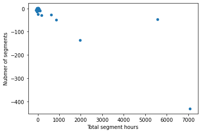
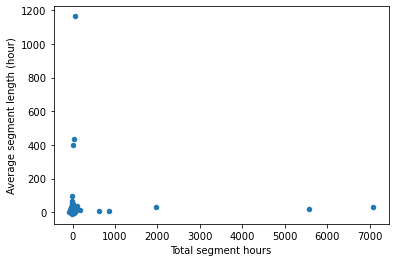
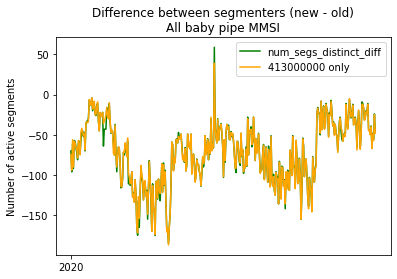

# Segmenter Version Comparison

This notebook calculates and visualizes key segment metrics to allow the user to compare a new pipeline to the old one for QA purposes. This was specifically built to compate pipe 3 to pipe 2.5 and is not guaranteed when using different pipeline versions. Even using a new version of pipe 3 may require some changes if column names have changed.

Author: Jenn Van Osdel  
Last Updated: August 24, 2022


```python
import os
import pandas as pd
import matplotlib.pyplot as plt
import pyseas.maps as psm
import pyseas.contrib as psc

from config import DATASET_OLD, DATASET_NEW_MONTHLY_INT, FRAGMENTS_TABLE, SEGMENTS_TABLE, MESSAGES_SEGMENTED_TABLE, SEGMENT_INFO_TABLE

pd.set_option("max_rows", 20)
```

## Data generation

*NOTE: this query is not fully flexible on dates and still assumes all data is within 2020 as hardcoding "2020" into the table suffix decreased query costs by ~95%. You may need to modify the query and check costs if running a period outside of 2020.*


```python
def make_daily(df):
    df_daily = df.copy().groupby(['date', 'year']).sum().reset_index()
    df_daily['avg_seg_length_h_new'] = df_daily.sum_seg_length_h_new / df_daily.num_segs_distinct_new
    df_daily['avg_seg_length_h_old'] = df_daily.sum_seg_length_h_old / df_daily.num_segs_distinct_old
    df_daily['avg_seg_length_h_diff'] = df_daily.avg_seg_length_h_new - df_daily.avg_seg_length_h_old
    return df_daily


```


```python
q = f'''
CREATE TEMP FUNCTION start_date() AS (
  (SELECT DATE(PARSE_TIMESTAMP("%Y%m%d", MIN(_TABLE_SUFFIX)))
  FROM `{DATASET_NEW_MONTHLY_INT}.{SEGMENTS_TABLE}*`)
);

CREATE TEMP FUNCTION end_date() AS (
  (SELECT DATE(PARSE_TIMESTAMP("%Y%m%d", MAX(_TABLE_SUFFIX)))
  FROM `{DATASET_NEW_MONTHLY_INT}.{SEGMENTS_TABLE}*`)
);

WITH 

segment_data_new AS (
    SELECT 
    DATE(seg.timestamp) AS date,
    EXTRACT(YEAR from DATE(seg.timestamp)) AS year,
    seg.ssvid AS ssvid,
    COUNT(*) AS num_segs,
    COUNT(DISTINCT seg_id) AS num_segs_distinct,
    SUM(TIMESTAMP_DIFF(frag.last_msg_timestamp, seg.first_timestamp, MINUTE)/60.0) AS sum_seg_length_h,
    SUM(TIMESTAMP_DIFF(frag.last_msg_timestamp, frag.first_msg_timestamp, MINUTE)/60.0) AS sum_seg_day_length_h,
    FROM `{DATASET_NEW_MONTHLY_INT}.{SEGMENTS_TABLE}*` seg
    JOIN `{DATASET_NEW_MONTHLY_INT}.{FRAGMENTS_TABLE}*` frag
    USING(frag_id)
    GROUP BY date, year, ssvid
),

segment_data_old AS (
      SELECT 
    DATE(timestamp) as date,
    EXTRACT(YEAR from DATE(timestamp)) as year,
    ssvid,
    COUNT(*) AS num_segs,
    COUNT(DISTINCT seg_id) AS num_segs_distinct,
    SUM(TIMESTAMP_DIFF(last_msg_of_day_timestamp, IF(DATE(first_msg_timestamp) >= start_date(), first_msg_timestamp, TIMESTAMP(start_date())), MINUTE)/60.0) as sum_seg_length_h,
    SUM(TIMESTAMP_DIFF(last_msg_of_day_timestamp, first_msg_of_day_timestamp, MINUTE)/60.0) AS sum_seg_day_length_h,
    FROM `{DATASET_OLD}.{SEGMENTS_TABLE}2020*`
    WHERE ssvid IN (SELECT DISTINCT ssvid FROM `{DATASET_NEW_MONTHLY_INT}.{SEGMENTS_TABLE}*`)
    AND _TABLE_SUFFIX BETWEEN FORMAT_TIMESTAMP("%m%d", start_date()) AND FORMAT_TIMESTAMP("%m%d", end_date())
    -- Necessary to filter out segments that have had no positions in 2020
    -- but have not yet closed because a new position isn't reported for
    -- that MMSI for days/weeks/months.
    AND first_msg_of_day_timestamp IS NOT NULL
    GROUP BY date, year, ssvid
),

segment_join AS (
    SELECT
    date,
    year,
    ssvid,
    IFNULL(segs_new.num_segs, 0) AS num_segs_new,
    IFNULL(segs_new.num_segs_distinct, 0) AS num_segs_distinct_new,
    IFNULL(segs_new.sum_seg_length_h, 0) AS sum_seg_length_h_new,
    IFNULL(segs_new.sum_seg_day_length_h, 0) AS sum_seg_day_length_h_new,
    IFNULL(segs_old.num_segs, 0) AS num_segs_old,
    IFNULL(segs_old.num_segs_distinct, 0) AS num_segs_distinct_old,
    IFNULL(segs_old.sum_seg_length_h, 0) AS sum_seg_length_h_old,
    IFNULL(segs_old.sum_seg_day_length_h, 0) AS sum_seg_day_length_h_old,
    FROM segment_data_new segs_new
    FULL OUTER JOIN segment_data_old segs_old
    USING(date, year, ssvid)
    ORDER BY ssvid, date
)

SELECT
date,
year,
ssvid,
num_segs_new,
num_segs_distinct_new,
sum_seg_length_h_new,
sum_seg_day_length_h_new,
num_segs_old,
num_segs_distinct_old,
sum_seg_length_h_old,
sum_seg_day_length_h_old,
(num_segs_new - num_segs_old) as num_segs_diff,
(num_segs_distinct_new - num_segs_distinct_old) as num_segs_distinct_diff,
(sum_seg_length_h_new - sum_seg_length_h_old) as sum_seg_length_h_diff,
(sum_seg_day_length_h_new - sum_seg_day_length_h_old) as sum_seg_day_length_h_diff,
FROM segment_join
'''

# print(q)
df_segs_daily_by_ssvid = pd.read_gbq(q, project_id='world-fishing-827', dialect='standard')

df_segs_daily = make_daily(df_segs_daily_by_ssvid)

# Quick checks for duplicate seg_id
assert(df_segs_daily_by_ssvid[df_segs_daily_by_ssvid.num_segs_new != df_segs_daily_by_ssvid.num_segs_distinct_new].shape[0] == 0)
assert(df_segs_daily[df_segs_daily.num_segs_new != df_segs_daily.num_segs_distinct_new].shape[0] == 0)
```

    /Users/jennifervanosdel/miniconda3/envs/rad/lib/python3.9/site-packages/google/auth/_default.py:70: UserWarning: Your application has authenticated using end user credentials from Google Cloud SDK without a quota project. You might receive a "quota exceeded" or "API not enabled" error. We recommend you rerun `gcloud auth application-default login` and make sure a quota project is added. Or you can use service accounts instead. For more information about service accounts, see https://cloud.google.com/docs/authentication/
      warnings.warn(_CLOUD_SDK_CREDENTIALS_WARNING)


```python
def plot_new_vs_old(df, col_prefix, title, ylabel=""):
    fig = plt.figure()
    ax = df[[f'{col_prefix}old']].plot(label='old')
    df[[f'{col_prefix}new']].plot(label='new', ax=ax)
    years = list(df.year.sort_values().unique())
    ax.set_xticks([t*365 for t in range(len(years))])
    ax.set_xticklabels(years)
    fig.patch.set_facecolor('white')
    plt.legend()
    plt.title(title)
    plt.ylabel(ylabel)
    return fig, ax


```


```python
def plot_diff(df, col_prefix, title, ylabel=""):
    fig = plt.figure()
    ax = df[[f'{col_prefix}diff']].plot(c='green', label='diff')
    years = list(df.year.sort_values().unique())
    ax.set_xticks([t*365 for t in range(len(years))])
    ax.set_xticklabels(years)
    fig.patch.set_facecolor('white')
    plt.legend()
    plt.title(title)
    plt.ylabel(ylabel)
    return fig, ax


```

## Daily Stats


```python
fig = plot_new_vs_old(df_segs_daily, col_prefix='num_segs_distinct_', 
                      title="Number of segments per day\nAll baby pipe MMSI",
                      ylabel="Number of active segments")
```


    <Figure size 432x288 with 0 Axes>


    

    


```python
fig = plot_diff(df_segs_daily, col_prefix='num_segs_distinct_', 
                title="Difference between segmenters (new - old)\nAll baby pipe MMSI",
                ylabel="Number of active segments")
```


    <Figure size 432x288 with 0 Axes>


    

    


```python
fig = plot_new_vs_old(df_segs_daily, col_prefix='sum_seg_length_h_', 
                      title="Total length of segments per day (hours)\nAll baby pipe MMSI",
                      ylabel="Total active segment hours")
```


    <Figure size 432x288 with 0 Axes>


    

    


```python
fig = plot_diff(df_segs_daily, col_prefix='sum_seg_length_h_', 
                title="Difference between segmenters (new - old)\nAll baby pipe MMSI",
                ylabel="Total active segment hours")
```


    <Figure size 432x288 with 0 Axes>


    

    


```python
fig = plot_new_vs_old(df_segs_daily, col_prefix='avg_seg_length_h_', 
                      title="Average length of active segments per day (hours)\nAll baby pipe MMSI",
                      ylabel="Avg. length of active segments (hour)")
```


    <Figure size 432x288 with 0 Axes>


    

    


```python
fig = plot_diff(df_segs_daily, col_prefix='avg_seg_length_h_', 
                title="Difference between segmenters (new - old)\nAll baby pipe MMSI",
                ylabel="Avg. length of active segments (hour)")
```


    <Figure size 432x288 with 0 Axes>


    

    


```python
fig = plot_new_vs_old(df_segs_daily, col_prefix='sum_seg_day_length_h_', 
                      title="Total length of segments in each day only (hours)\nAll baby pipe MMSI",
                      ylabel="Total segment hours for day only")
```


    <Figure size 432x288 with 0 Axes>


    

    


```python
fig = plot_diff(df_segs_daily, col_prefix='sum_seg_day_length_h_', 
                title="Difference between segmenters (new - old)\nAll baby pipe MMSI",
                ylabel="Total segment hours for day only")
```


    <Figure size 432x288 with 0 Axes>


    

    


## MMSI with biggest changes


```python
q = f'''
WITH

seg_hours_new AS (
  SELECT 
    ssvid,
    seg_id,
    TIMESTAMP_DIFF(last_timestamp, first_timestamp, MINUTE)/60.0 as hours
  FROM `{DATASET_NEW_MONTHLY_INT}.{SEGMENT_INFO_TABLE}`
),

seg_hours_old AS (
  SELECT
    ssvid, 
    seg_id,
    TIMESTAMP_DIFF(
        IF(last_timestamp <= '2020-12-31 23:59:59', last_timestamp, TIMESTAMP('2020-12-31 23:59:59')),
        IF(first_timestamp >= '2020-01-01', first_timestamp, TIMESTAMP('2020-01-01'))
        , MINUTE)/60.0 as hours
  FROM `{DATASET_OLD}.{SEGMENT_INFO_TABLE}`
  WHERE (DATE(first_timestamp) <= '2020-12-31' AND DATE(last_timestamp) >= '2020-01-01')
  AND (ssvid IN (SELECT DISTINCT ssvid FROM `{DATASET_NEW_MONTHLY_INT}.{SEGMENT_INFO_TABLE}`))
),

ssvid_stats_new AS (
  SELECT 
    ssvid,
    COUNT(*) as num_segs_new,
    COUNT(DISTINCT seg_id) as num_segs_distinct_new,
    SUM(hours) as sum_seg_length_h_new,
    SUM(hours) / COUNT(*) as avg_seg_length_h_new
  FROM seg_hours_new
  GROUP BY ssvid
),

ssvid_stats_old AS (
  SELECT 
    ssvid,
    COUNT(*) as num_segs_old,
    COUNT(DISTINCT seg_id) as num_segs_distinct_old,
    SUM(hours) as sum_seg_length_h_old,
    SUM(hours) / COUNT(*) as avg_seg_length_h_old
  FROM seg_hours_old
  GROUP BY ssvid
)

SELECT *,
num_segs_new - num_segs_old AS num_segs_diff,
num_segs_distinct_new - num_segs_distinct_old AS num_segs_distinct_diff,
sum_seg_length_h_new - sum_seg_length_h_old AS sum_seg_length_h_diff,
avg_seg_length_h_new - avg_seg_length_h_old AS avg_seg_length_h_diff,
ABS(num_segs_new - num_segs_old) AS num_segs_diff_abs,
ABS(num_segs_distinct_new - num_segs_distinct_old) AS num_segs_distinct_diff_abs,
ABS(sum_seg_length_h_new - sum_seg_length_h_old) AS sum_seg_length_h_diff_abs,
ABS(avg_seg_length_h_new - avg_seg_length_h_old) AS avg_seg_length_h_diff_abs,
FROM ssvid_stats_new
FULL OUTER JOIN ssvid_stats_old
USING(ssvid)
'''
# print(q)
df_ssvid_stats = pd.read_gbq(q, project_id='world-fishing-827', dialect='standard')
```

#### Summary of changes

The overwhelming majority of the drop in the number of segments occurs for `413000000`. The decrease in the number of segments is smaller for the rest of the MMSI but the majority of MMSI have a decrease in segments.

The decrease in the segment hours is more evenly spread over the MMSI with more larger decreases in hours coming from more frequently spoofed MMSI. The difference in total segment hours for an MMSI is well correlated to its difference in number of segments but not to the change in the average segment length. This means that some segments are impacted more than others by the changes to the segmenter.


```python
df_ssvid_stats[df_ssvid_stats.ssvid != '413000000'].plot.scatter(
        x="sum_seg_length_h_diff",
        y="num_segs_distinct_diff")
plt.xlabel("Total segment hours")
plt.ylabel("Nubmer of segments")
plt.show()
```


    

    


```python
df_ssvid_stats[df_ssvid_stats.ssvid != '413000000'].plot.scatter(
        x="sum_seg_length_h_diff",
        y="avg_seg_length_h_diff")
plt.xlabel("Total segment hours")
plt.ylabel("Average segment length (hour)")
plt.show()
```


    

    


#### Number of segments


```python
df_ssvid_stats.sort_values("num_segs_distinct_diff_abs", ascending=False)[:10][['ssvid', 'num_segs_distinct_new', 'num_segs_distinct_old', 'num_segs_distinct_diff', 'num_segs_distinct_diff_abs']].reset_index(drop=True)
```


<div>
<style scoped>
    .dataframe tbody tr th:only-of-type {
        vertical-align: middle;
    }

    .dataframe tbody tr th {
        vertical-align: top;
    }

    .dataframe thead th {
        text-align: right;
    }
</style>
<table border="1" class="dataframe">
  <thead>
    <tr style="text-align: right;">
      <th></th>
      <th>ssvid</th>
      <th>num_segs_distinct_new</th>
      <th>num_segs_distinct_old</th>
      <th>num_segs_distinct_diff</th>
      <th>num_segs_distinct_diff_abs</th>
    </tr>
  </thead>
  <tbody>
    <tr>
      <th>0</th>
      <td>413000000</td>
      <td>6844</td>
      <td>50887</td>
      <td>-44043</td>
      <td>44043</td>
    </tr>
    <tr>
      <th>1</th>
      <td>100900000</td>
      <td>775</td>
      <td>1206</td>
      <td>-431</td>
      <td>431</td>
    </tr>
    <tr>
      <th>2</th>
      <td>567000000</td>
      <td>292</td>
      <td>428</td>
      <td>-136</td>
      <td>136</td>
    </tr>
    <tr>
      <th>3</th>
      <td>271055001</td>
      <td>297</td>
      <td>345</td>
      <td>-48</td>
      <td>48</td>
    </tr>
    <tr>
      <th>4</th>
      <td>666000001</td>
      <td>395</td>
      <td>442</td>
      <td>-47</td>
      <td>47</td>
    </tr>
    <tr>
      <th>5</th>
      <td>416245700</td>
      <td>151</td>
      <td>180</td>
      <td>-29</td>
      <td>29</td>
    </tr>
    <tr>
      <th>6</th>
      <td>244453043</td>
      <td>143</td>
      <td>170</td>
      <td>-27</td>
      <td>27</td>
    </tr>
    <tr>
      <th>7</th>
      <td>636019687</td>
      <td>53</td>
      <td>78</td>
      <td>-25</td>
      <td>25</td>
    </tr>
    <tr>
      <th>8</th>
      <td>224306000</td>
      <td>54</td>
      <td>67</td>
      <td>-13</td>
      <td>13</td>
    </tr>
    <tr>
      <th>9</th>
      <td>565382000</td>
      <td>27</td>
      <td>39</td>
      <td>-12</td>
      <td>12</td>
    </tr>
  </tbody>
</table>
</div>


#### Total segment hours


```python
df_ssvid_stats.sort_values("sum_seg_length_h_diff_abs", ascending=False)[:10][['ssvid', 'sum_seg_length_h_new', 'sum_seg_length_h_old', 'sum_seg_length_h_diff', 'sum_seg_length_h_diff_abs', 'num_segs_distinct_new', 'num_segs_distinct_old', 'num_segs_distinct_diff', 'num_segs_distinct_diff_abs']].reset_index(drop=True)
```


<div>
<style scoped>
    .dataframe tbody tr th:only-of-type {
        vertical-align: middle;
    }

    .dataframe tbody tr th {
        vertical-align: top;
    }

    .dataframe thead th {
        text-align: right;
    }
</style>
<table border="1" class="dataframe">
  <thead>
    <tr style="text-align: right;">
      <th></th>
      <th>ssvid</th>
      <th>sum_seg_length_h_new</th>
      <th>sum_seg_length_h_old</th>
      <th>sum_seg_length_h_diff</th>
      <th>sum_seg_length_h_diff_abs</th>
      <th>num_segs_distinct_new</th>
      <th>num_segs_distinct_old</th>
      <th>num_segs_distinct_diff</th>
      <th>num_segs_distinct_diff_abs</th>
    </tr>
  </thead>
  <tbody>
    <tr>
      <th>0</th>
      <td>413000000</td>
      <td>463400.783333</td>
      <td>86152.633333</td>
      <td>377248.150000</td>
      <td>377248.150000</td>
      <td>6844</td>
      <td>50887</td>
      <td>-44043</td>
      <td>44043</td>
    </tr>
    <tr>
      <th>1</th>
      <td>100900000</td>
      <td>51555.033333</td>
      <td>44466.250000</td>
      <td>7088.783333</td>
      <td>7088.783333</td>
      <td>775</td>
      <td>1206</td>
      <td>-431</td>
      <td>431</td>
    </tr>
    <tr>
      <th>2</th>
      <td>666000001</td>
      <td>27010.450000</td>
      <td>21433.683333</td>
      <td>5576.766667</td>
      <td>5576.766667</td>
      <td>395</td>
      <td>442</td>
      <td>-47</td>
      <td>47</td>
    </tr>
    <tr>
      <th>3</th>
      <td>567000000</td>
      <td>22060.333333</td>
      <td>20097.150000</td>
      <td>1963.183333</td>
      <td>1963.183333</td>
      <td>292</td>
      <td>428</td>
      <td>-136</td>
      <td>136</td>
    </tr>
    <tr>
      <th>4</th>
      <td>271055001</td>
      <td>10282.833333</td>
      <td>9421.816667</td>
      <td>861.016667</td>
      <td>861.016667</td>
      <td>297</td>
      <td>345</td>
      <td>-48</td>
      <td>48</td>
    </tr>
    <tr>
      <th>5</th>
      <td>244453043</td>
      <td>4285.750000</td>
      <td>3654.550000</td>
      <td>631.200000</td>
      <td>631.200000</td>
      <td>143</td>
      <td>170</td>
      <td>-27</td>
      <td>27</td>
    </tr>
    <tr>
      <th>6</th>
      <td>416245700</td>
      <td>9423.966667</td>
      <td>9244.850000</td>
      <td>179.116667</td>
      <td>179.116667</td>
      <td>151</td>
      <td>180</td>
      <td>-29</td>
      <td>29</td>
    </tr>
    <tr>
      <th>7</th>
      <td>273438920</td>
      <td>7949.783333</td>
      <td>7834.033333</td>
      <td>115.750000</td>
      <td>115.750000</td>
      <td>41</td>
      <td>50</td>
      <td>-9</td>
      <td>9</td>
    </tr>
    <tr>
      <th>8</th>
      <td>367776660</td>
      <td>9037.683333</td>
      <td>9122.633333</td>
      <td>-84.950000</td>
      <td>84.950000</td>
      <td>144</td>
      <td>151</td>
      <td>-7</td>
      <td>7</td>
    </tr>
    <tr>
      <th>9</th>
      <td>725000929</td>
      <td>7041.816667</td>
      <td>6965.966667</td>
      <td>75.850000</td>
      <td>75.850000</td>
      <td>65</td>
      <td>74</td>
      <td>-9</td>
      <td>9</td>
    </tr>
  </tbody>
</table>
</div>


#### Average segment length (hours)


```python
df_ssvid_stats.sort_values("avg_seg_length_h_diff_abs", ascending=False)[:10][['ssvid', 'avg_seg_length_h_new', 'avg_seg_length_h_old', 'avg_seg_length_h_diff', 'avg_seg_length_h_diff_abs']].reset_index(drop=True)
```


<div>
<style scoped>
    .dataframe tbody tr th:only-of-type {
        vertical-align: middle;
    }

    .dataframe tbody tr th {
        vertical-align: top;
    }

    .dataframe thead th {
        text-align: right;
    }
</style>
<table border="1" class="dataframe">
  <thead>
    <tr style="text-align: right;">
      <th></th>
      <th>ssvid</th>
      <th>avg_seg_length_h_new</th>
      <th>avg_seg_length_h_old</th>
      <th>avg_seg_length_h_diff</th>
      <th>avg_seg_length_h_diff_abs</th>
    </tr>
  </thead>
  <tbody>
    <tr>
      <th>0</th>
      <td>244020394</td>
      <td>2887.644444</td>
      <td>1722.830000</td>
      <td>1164.814444</td>
      <td>1164.814444</td>
    </tr>
    <tr>
      <th>1</th>
      <td>229000611</td>
      <td>2153.312500</td>
      <td>1717.796667</td>
      <td>435.515833</td>
      <td>435.515833</td>
    </tr>
    <tr>
      <th>2</th>
      <td>237352400</td>
      <td>1399.083333</td>
      <td>999.359524</td>
      <td>399.723810</td>
      <td>399.723810</td>
    </tr>
    <tr>
      <th>3</th>
      <td>565382000</td>
      <td>320.167284</td>
      <td>222.122650</td>
      <td>98.044634</td>
      <td>98.044634</td>
    </tr>
    <tr>
      <th>4</th>
      <td>520318000</td>
      <td>415.976190</td>
      <td>349.548667</td>
      <td>66.427524</td>
      <td>66.427524</td>
    </tr>
    <tr>
      <th>5</th>
      <td>413000000</td>
      <td>67.709057</td>
      <td>1.693019</td>
      <td>66.016038</td>
      <td>66.016038</td>
    </tr>
    <tr>
      <th>6</th>
      <td>412420375</td>
      <td>729.625000</td>
      <td>673.555128</td>
      <td>56.069872</td>
      <td>56.069872</td>
    </tr>
    <tr>
      <th>7</th>
      <td>636019687</td>
      <td>153.153459</td>
      <td>103.820940</td>
      <td>49.332519</td>
      <td>49.332519</td>
    </tr>
    <tr>
      <th>8</th>
      <td>416004378</td>
      <td>318.790909</td>
      <td>280.616000</td>
      <td>38.174909</td>
      <td>38.174909</td>
    </tr>
    <tr>
      <th>9</th>
      <td>273438920</td>
      <td>193.897154</td>
      <td>156.680667</td>
      <td>37.216488</td>
      <td>37.216488</td>
    </tr>
  </tbody>
</table>
</div>


## Daily patterns of 413000000

`413000000` generally dominates the overall pattern so it is interesting to see that and to see what the pattern looks like without `413000000`

### The difference in the number of segments and hours of all MMSI vs just `413000000` 

To confirm that `413000000` dominates the pattern. This may not be true for future QA and your copy of this notebook may need to be modified to look deeper.


```python
fig, ax = plot_diff(df_segs_daily, col_prefix='num_segs_distinct_', 
                title="Difference between segmenters (new - old)\nAll baby pipe MMSI",
                ylabel="Number of active segments")
df_temp = df_segs_daily_by_ssvid[df_segs_daily_by_ssvid.ssvid == '413000000'].copy().reset_index(drop=True)
df_temp.num_segs_distinct_diff.plot(c='orange', ax=ax, label='413000000 only')
plt.legend()
plt.show()
```


    <Figure size 432x288 with 0 Axes>


    

    


```python
fig, ax = plot_diff(df_segs_daily, col_prefix='sum_seg_length_h_', 
                title="Difference between segmenters (new - old)\nAll baby pipe MMSI",
                ylabel="Total active segment hours")
df_temp = df_segs_daily_by_ssvid[df_segs_daily_by_ssvid.ssvid == '413000000'].copy().reset_index(drop=True)
df_temp.sum_seg_length_h_diff.plot(c='orange', ax=ax, label='413000000 only')
plt.legend()
plt.show()
```


    <Figure size 432x288 with 0 Axes>


    

    


## Daily Stats WITHOUT `413000000`


```python
df_segs_daily_no_413000000 = make_daily(df_segs_daily_by_ssvid[df_segs_daily_by_ssvid.ssvid != '413000000'])


```


```python
fig = plot_new_vs_old(df_segs_daily_no_413000000, col_prefix='num_segs_distinct_', 
                      title="Number of segments per day\nExcluding 413000000",
                      ylabel="Number of active segments")
```


    <Figure size 432x288 with 0 Axes>


    

    


```python
fig = plot_diff(df_segs_daily_no_413000000, col_prefix='num_segs_distinct_', 
                title="Difference between segmenters (new - old)\nExcluding 413000000",
                ylabel="Number of active segments")
```


    <Figure size 432x288 with 0 Axes>


    

    


```python
fig = plot_new_vs_old(df_segs_daily_no_413000000, col_prefix='sum_seg_length_h_', 
                      title="Total length of segments per day (hours)\nExcluding 413000000",
                      ylabel="Total active segment hours")
```


    <Figure size 432x288 with 0 Axes>


    

    


```python
fig = plot_diff(df_segs_daily_no_413000000, col_prefix='sum_seg_length_h_', 
                title="Difference between segmenters (new - old)\nExcluding 413000000",
                ylabel="Total active segment hours")
```


    <Figure size 432x288 with 0 Axes>


    

    


```python
fig = plot_new_vs_old(df_segs_daily_no_413000000, col_prefix='avg_seg_length_h_', 
                      title="Average length of active segments per day\nExcluding 413000000",
                      ylabel="Avg. length of active segments (hour)")
```


    <Figure size 432x288 with 0 Axes>


    

    


```python
fig = plot_diff(df_segs_daily_no_413000000, col_prefix='avg_seg_length_h_', 
                title="Difference between segmenters (new - old)\nExcluding 413000000",
                ylabel="Avg. length of active segments (hour)")
```


    <Figure size 432x288 with 0 Axes>


    

    


```python
fig = plot_new_vs_old(df_segs_daily_no_413000000, col_prefix='sum_seg_day_length_h_', 
                      title="Total length of segments in each day only (hours)\nAll baby pipe MMSI",
                      ylabel="Total segment hours for day only")
```


    <Figure size 432x288 with 0 Axes>


    

    


```python
fig = plot_diff(df_segs_daily_no_413000000, col_prefix='sum_seg_day_length_h_', 
                title="Difference between segmenters (new - old)\nAll baby pipe MMSI",
                ylabel="Total segment hours for day only")
```


    <Figure size 432x288 with 0 Axes>


    

    


## Overall segment Stats

Calculated at the segment level for the set of final segments in 2020. Segment lengths for the old dataset are truncated as starting on '2020-01-01' for comparability.


```python
q = f'''
WITH

seg_hours_new AS (
  SELECT 
    seg_id,
    TIMESTAMP_DIFF(last_timestamp, first_timestamp, MINUTE)/60.0 as hours
  FROM `{DATASET_NEW_MONTHLY_INT}.{SEGMENT_INFO_TABLE}`
),

seg_hours_no_413000000_new AS (
  SELECT 
    seg_id,
    TIMESTAMP_DIFF(last_timestamp, first_timestamp, MINUTE)/60.0 as hours
  FROM `{DATASET_NEW_MONTHLY_INT}.{SEGMENT_INFO_TABLE}`
  WHERE ssvid != '413000000'
),

seg_hours_old AS (
  SELECT 
    seg_id,
    TIMESTAMP_DIFF(
        IF(last_timestamp <= '2020-12-31 23:59:59', last_timestamp, TIMESTAMP('2020-12-31 23:59:59')),
        IF(first_timestamp >= '2020-01-01', first_timestamp, TIMESTAMP('2020-01-01'))
        , MINUTE)/60.0 as hours
  FROM `{DATASET_OLD}.{SEGMENT_INFO_TABLE}`
  WHERE (DATE(first_timestamp) <= '2020-12-31' AND DATE(last_timestamp) >= '2020-01-01')
  AND (ssvid IN (SELECT DISTINCT ssvid FROM `{DATASET_NEW_MONTHLY_INT}.{SEGMENT_INFO_TABLE}`))
),

seg_hours_no_413000000_old AS (
  SELECT 
    seg_id,
    TIMESTAMP_DIFF(
        IF(last_timestamp <= '2020-12-31 23:59:59', last_timestamp, TIMESTAMP('2020-12-31 23:59:59')),
        IF(first_timestamp >= '2020-01-01', first_timestamp, TIMESTAMP('2020-01-01'))
        , MINUTE)/60.0 as hours
  FROM `{DATASET_OLD}.{SEGMENT_INFO_TABLE}`
  WHERE (DATE(first_timestamp) <= '2020-12-31' AND DATE(last_timestamp) >= '2020-01-01')
  AND (ssvid IN (SELECT DISTINCT ssvid FROM `{DATASET_NEW_MONTHLY_INT}.{SEGMENT_INFO_TABLE}`))
  AND ssvid != '413000000'
),

all_mmsi_stats AS (
SELECT 'all mmsi' as description, * EXCEPT (jn)
FROM
(
  SELECT 
    1 as jn,   
    COUNT(*) as num_segs_new,
    COUNT(DISTINCT seg_id) as num_segs_distinct_new,
    SUM(hours) as sum_seg_length_h_new,
    SUM(hours)/COUNT(*) as avg_hours_new
  FROM seg_hours_new
) 
JOIN
(
  SELECT 
    1 as jn,   
    COUNT(*) as num_segs_old,
    COUNT(DISTINCT seg_id) as num_segs_distinct_old,
    SUM(hours) as sum_seg_length_h_old,
    SUM(hours)/COUNT(*) as avg_hours_old
  FROM seg_hours_old
) 
USING (jn)
),

no_413000000_stats AS (
  SELECT 'no 413000000' as description, * EXCEPT (jn)
FROM
(
  SELECT 
    1 as jn,   
    COUNT(*) as num_segs_new,
    COUNT(DISTINCT seg_id) as num_segs_distinct_new,
    SUM(hours) as sum_seg_length_h_new,
    SUM(hours)/COUNT(*) as avg_hours_new
  FROM seg_hours_no_413000000_new
) 
JOIN
(
  SELECT 
    1 as jn,   
    COUNT(*) as num_segs_old,
    COUNT(DISTINCT seg_id) as num_segs_distinct_old,
    SUM(hours) as sum_seg_length_h_old,
    SUM(hours)/COUNT(*) as avg_hours_old
  FROM seg_hours_no_413000000_old
) 
USING (jn)
)

(SELECT * FROM all_mmsi_stats)
UNION ALL
(SELECT * FROM no_413000000_stats)
ORDER BY description
'''

# print(q)
df_seg_stats = pd.read_gbq(q, project_id='world-fishing-827', dialect='standard')
```


```python
df_seg_stats_all_mmsi = df_seg_stats[df_seg_stats.description == 'all mmsi'].copy().iloc[0]
df_seg_stats_no_413000000 = df_seg_stats[df_seg_stats.description == 'no 413000000'].copy().iloc[0]
```


```python
print("STATS FOR ALL MMSI")
print("--------------------")
print(f"Num distinct segs (NEW):  {df_seg_stats_all_mmsi.num_segs_distinct_new}")
print(f"Num distinct segs (OLD):  {df_seg_stats_all_mmsi.num_segs_distinct_old}")
print(f"Num distinct segs (DIFF): {df_seg_stats_all_mmsi.num_segs_distinct_new - df_seg_stats_all_mmsi.num_segs_distinct_old}")
print()
print(f"Sum seg hours (NEW):  {round(df_seg_stats_all_mmsi.sum_seg_length_h_new):,d}")
print(f"Sum seg hours (OLD):  {round(df_seg_stats_all_mmsi.sum_seg_length_h_old):,d}")
print(f"Sum seg hours (DIFF): {round(df_seg_stats_all_mmsi.sum_seg_length_h_new - df_seg_stats_all_mmsi.sum_seg_length_h_old):,d}")
print()
print(f"Avg seg length (NEW): {df_seg_stats_all_mmsi.avg_hours_new:0.2f}")
print(f"Avg seg length (OLD): {df_seg_stats_all_mmsi.avg_hours_old:0.2f}")
print(f"Avg seg length (DIFF): {df_seg_stats_all_mmsi.avg_hours_new - df_seg_stats_all_mmsi.avg_hours_old:0.2f}")


```

    STATS FOR ALL MMSI
    --------------------
    Num distinct segs (NEW):  12959
    Num distinct segs (OLD):  57920
    Num distinct segs (DIFF): -44961
    
    Sum seg hours (NEW):  1,175,264
    Sum seg hours (OLD):  781,371
    Sum seg hours (DIFF): 393,893
    
    Avg seg length (NEW): 90.69
    Avg seg length (OLD): 13.49
    Avg seg length (DIFF): 77.20


```python
print("STATS WITHOUT 413000000")
print("--------------------")
print(f"Num distinct segs (NEW):  {df_seg_stats_no_413000000.num_segs_distinct_new}")
print(f"Num distinct segs (OLD):  {df_seg_stats_no_413000000.num_segs_distinct_old}")
print(f"Num distinct segs (DIFF): {df_seg_stats_no_413000000.num_segs_distinct_new - df_seg_stats_no_413000000.num_segs_distinct_old}")
print()
print(f"Sum seg hours (NEW):  {round(df_seg_stats_no_413000000.sum_seg_length_h_new):,d}")
print(f"Sum seg hours (OLD):  {round(df_seg_stats_no_413000000.sum_seg_length_h_old):,d}")
print(f"Sum seg hours (DIFF): {round(df_seg_stats_no_413000000.sum_seg_length_h_new - df_seg_stats_no_413000000.sum_seg_length_h_old):,d}")
print()
print(f"Avg seg length (NEW): {df_seg_stats_no_413000000.avg_hours_new:0.2f}")
print(f"Avg seg length (OLD): {df_seg_stats_no_413000000.avg_hours_old:0.2f}")
print(f"Avg seg length (DIFF): {df_seg_stats_no_413000000.avg_hours_new - df_seg_stats_no_413000000.avg_hours_old:0.2f}")


```

    STATS WITHOUT 413000000
    --------------------
    Num distinct segs (NEW):  6115
    Num distinct segs (OLD):  7033
    Num distinct segs (DIFF): -918
    
    Sum seg hours (NEW):  711,863
    Sum seg hours (OLD):  695,219
    Sum seg hours (DIFF): 16,644
    
    Avg seg length (NEW): 116.41
    Avg seg length (OLD): 98.85
    Avg seg length (DIFF): 17.56


```python

```


```python

```


```python

```

# Code for pulling tracks, as needed

If you need to investigate particular MMSI, you can plot in this notebook using pyseas and/or you can download a CSV of tracks to upload to the Global Fishing Watch online map. For very spoofy MMSI or for long periods of time, the map may be a better option as pyseas will struggle or fail to render too many segments. Also if there are a lot of segments, be sure to set `plot_legend` to False as rendering a long list of segment names will cause it to slow down significantly or fail.

#### Plot with `pyseas`


```python
def get_tracks(dataset, ssvid, start_date, end_date):
    '''
    Retrieve the tracks for a given MMSI over a given date range in
    the form of AIS messages with lat, lon, timestamp, and seg_id to 
    allow for plotting.

    Args:
        dataset: string representing BigQuery dataset containing messages_segmented table
        ssvid: MMSI for the vessel of interest
        start_date: first date to consider for tracks in format "YYYYMMDD"
        end_date: last date to consider for tracks in format "YYYYMMDD"

    Returns:
        dataframe of tracks
    '''
    q = f'''
    SELECT 
    ssvid, timestamp, lat, lon, seg_id
    FROM `{dataset}.{MESSAGES_SEGMENTED_TABLE}*`
    WHERE ssvid = '{ssvid}'
    AND _TABLE_SUFFIX BETWEEN '{start_date}' AND '{end_date}'
    AND seg_id IS NOT NULL
    ORDER BY timestamp
    '''

    # print(q)
    return pd.read_gbq(q, project_id='world-fishing-827', dialect='standard')
```


```python
def get_segments(dataset, ssvid, start_date, end_date):
    '''
    Retrieve the segments for a given MMSI betwee a given date range.

    Args:
        dataset: string representing BigQuery dataset containing segment_info table
        ssvid: MMSI for the vessel of interest
        start_date: first date to consider for tracks in format "YYYY-MM-DD"
        end_date: last date to consider for tracks in format "YYYY-MM-DD"

    Returns:
        dataframe of segments
    '''
    q = f'''
    SELECT 
    *
    FROM `{dataset}.{SEGMENT_INFO_TABLE}*`
    WHERE ssvid = '{ssvid}'
    AND (DATE(first_timestamp) <= '{end_date}' AND DATE(last_timestamp) >= '{start_date}')
    ORDER BY seg_id
    '''

    # print(q)
    return pd.read_gbq(q, project_id='world-fishing-827', dialect='standard')
```


```python
def plot_segmented_tracks(df, plot_legend=True):
    '''
    Plot tracks on a map with different segments divided by color.

    Args:
        df: dataframe containing tracks to plot, requires lat, lon, timestamp, and seg_id
        plot_legend: if legend should be added (default=True)

    Returns:
        matplotlib figure
    '''
    with psm.context(psm.styles.panel):
        fig = plt.figure(figsize=(12, 12))
        info = psc.multi_track_panel(
            df.timestamp,
            df.lon,
            df.lat,
            df.seg_id,
            plots=[{"label": "lon", "values": df.lon}, {"label": "lat", "values": df.lat}],
        )
        if plot_legend:
            plt.legend(
                info.legend_handles.values(),
                [x.split("-", 1)[1].rstrip(".000000000Z") for x in info.legend_handles.keys()],
            )
        return fig


```

##### Step 1: Explore segments to chose dates to pull tracks


```python
ssvid_1 = '538004933'
segs_1 = get_segments(DATASET_NEW_MONTHLY_INT, ssvid_1, '2020-01-01', '2020-12-31')
```


```python
segs_1
```


<div>
<style scoped>
    .dataframe tbody tr th:only-of-type {
        vertical-align: middle;
    }

    .dataframe tbody tr th {
        vertical-align: top;
    }

    .dataframe thead th {
        text-align: right;
    }
</style>
<table border="1" class="dataframe">
  <thead>
    <tr style="text-align: right;">
      <th></th>
      <th>vessel_id</th>
      <th>seg_id</th>
      <th>ssvid</th>
      <th>first_timestamp</th>
      <th>last_timestamp</th>
      <th>msg_count</th>
      <th>pos_count</th>
      <th>ident_count</th>
      <th>noise</th>
      <th>shipname</th>
      <th>callsign</th>
      <th>imo</th>
      <th>n_shipname</th>
      <th>n_callsign</th>
      <th>n_imo</th>
      <th>shiptype</th>
      <th>length</th>
      <th>width</th>
    </tr>
  </thead>
  <tbody>
    <tr>
      <th>0</th>
      <td>386e7dc33-3699-f921-2f48-56ce5ff330f2</td>
      <td>538004933-2020-01-01T00:03:53.000000Z-1</td>
      <td>538004933</td>
      <td>2020-01-01 00:03:53+00:00</td>
      <td>2020-01-12 20:36:44+00:00</td>
      <td>21570</td>
      <td>4562</td>
      <td>17008</td>
      <td>False</td>
      <td>{'value': 'NAVIN RAVEN', 'count': 17008, 'freq...</td>
      <td>{'value': 'V7ZW9', 'count': 17008, 'freq': 1.0}</td>
      <td>{'value': '9368649', 'count': 17008, 'freq': 1.0}</td>
      <td>{'value': 'NAVINRAVEN', 'count': 17008, 'freq'...</td>
      <td>{'value': 'V7ZW9', 'count': 17008, 'freq': 1.0}</td>
      <td>{'value': '9368649', 'count': 17008, 'freq': 1.0}</td>
      <td>None</td>
      <td>{'value': '121.0', 'count': 17008, 'freq': 1.0}</td>
      <td>{'value': '17.0', 'count': 17008, 'freq': 1.0}</td>
    </tr>
    <tr>
      <th>1</th>
      <td>386e7dc33-3699-f921-2f48-56ce5ff330f2</td>
      <td>538004933-2020-01-11T05:07:47.000000Z-1</td>
      <td>538004933</td>
      <td>2020-01-11 05:07:47+00:00</td>
      <td>2020-01-11 05:07:47+00:00</td>
      <td>1</td>
      <td>1</td>
      <td>0</td>
      <td>False</td>
      <td>None</td>
      <td>None</td>
      <td>None</td>
      <td>None</td>
      <td>None</td>
      <td>None</td>
      <td>None</td>
      <td>None</td>
      <td>None</td>
    </tr>
    <tr>
      <th>2</th>
      <td>386e7dc33-3699-f921-2f48-56ce5ff330f2</td>
      <td>538004933-2020-01-12T09:29:45.000000Z-1</td>
      <td>538004933</td>
      <td>2020-01-12 09:29:45+00:00</td>
      <td>2020-01-12 09:29:45+00:00</td>
      <td>1</td>
      <td>1</td>
      <td>0</td>
      <td>False</td>
      <td>None</td>
      <td>None</td>
      <td>None</td>
      <td>None</td>
      <td>None</td>
      <td>None</td>
      <td>None</td>
      <td>None</td>
      <td>None</td>
    </tr>
    <tr>
      <th>3</th>
      <td>386e7dc33-3699-f921-2f48-56ce5ff330f2</td>
      <td>538004933-2020-01-13T23:49:52.000000Z-1</td>
      <td>538004933</td>
      <td>2020-01-13 23:49:52+00:00</td>
      <td>2020-01-25 19:59:05+00:00</td>
      <td>16396</td>
      <td>3569</td>
      <td>12827</td>
      <td>False</td>
      <td>{'value': 'NAVIN RAVEN', 'count': 12827, 'freq...</td>
      <td>{'value': 'V7ZW9', 'count': 12827, 'freq': 1.0}</td>
      <td>{'value': '9368649', 'count': 12827, 'freq': 1.0}</td>
      <td>{'value': 'NAVINRAVEN', 'count': 12827, 'freq'...</td>
      <td>{'value': 'V7ZW9', 'count': 12827, 'freq': 1.0}</td>
      <td>{'value': '9368649', 'count': 12827, 'freq': 1.0}</td>
      <td>None</td>
      <td>{'value': '121.0', 'count': 12827, 'freq': 1.0}</td>
      <td>{'value': '17.0', 'count': 12827, 'freq': 1.0}</td>
    </tr>
    <tr>
      <th>4</th>
      <td>386e7dc33-3699-f921-2f48-56ce5ff330f2</td>
      <td>538004933-2020-01-14T03:40:34.000000Z-1</td>
      <td>538004933</td>
      <td>2020-01-14 03:40:34+00:00</td>
      <td>2020-01-14 03:40:34+00:00</td>
      <td>1</td>
      <td>1</td>
      <td>0</td>
      <td>False</td>
      <td>None</td>
      <td>None</td>
      <td>None</td>
      <td>None</td>
      <td>None</td>
      <td>None</td>
      <td>None</td>
      <td>None</td>
      <td>None</td>
    </tr>
    <tr>
      <th>...</th>
      <td>...</td>
      <td>...</td>
      <td>...</td>
      <td>...</td>
      <td>...</td>
      <td>...</td>
      <td>...</td>
      <td>...</td>
      <td>...</td>
      <td>...</td>
      <td>...</td>
      <td>...</td>
      <td>...</td>
      <td>...</td>
      <td>...</td>
      <td>...</td>
      <td>...</td>
      <td>...</td>
    </tr>
    <tr>
      <th>19</th>
      <td>386e7dc33-3699-f921-2f48-56ce5ff330f2</td>
      <td>538004933-2020-08-10T07:11:13.000000Z-1</td>
      <td>538004933</td>
      <td>2020-08-10 07:11:13+00:00</td>
      <td>2020-09-01 15:55:04+00:00</td>
      <td>8349</td>
      <td>3513</td>
      <td>4836</td>
      <td>False</td>
      <td>{'value': 'NAVIN RAVEN', 'count': 4836, 'freq'...</td>
      <td>{'value': 'V7ZW9', 'count': 4836, 'freq': 1.0}</td>
      <td>{'value': '9368649', 'count': 4836, 'freq': 1.0}</td>
      <td>{'value': 'NAVINRAVEN', 'count': 4836, 'freq':...</td>
      <td>{'value': 'V7ZW9', 'count': 4836, 'freq': 1.0}</td>
      <td>{'value': '9368649', 'count': 4836, 'freq': 1.0}</td>
      <td>None</td>
      <td>{'value': '121.0', 'count': 4836, 'freq': 1.0}</td>
      <td>{'value': '17.0', 'count': 4836, 'freq': 1.0}</td>
    </tr>
    <tr>
      <th>20</th>
      <td>386e7dc33-3699-f921-2f48-56ce5ff330f2</td>
      <td>538004933-2020-09-03T02:47:39.000000Z-1</td>
      <td>538004933</td>
      <td>2020-09-03 02:47:39+00:00</td>
      <td>2020-09-20 19:28:26+00:00</td>
      <td>11060</td>
      <td>3397</td>
      <td>7663</td>
      <td>False</td>
      <td>{'value': 'NAVIN RAVEN', 'count': 7663, 'freq'...</td>
      <td>{'value': 'V7ZW9', 'count': 7663, 'freq': 1.0}</td>
      <td>{'value': '9368649', 'count': 7663, 'freq': 1.0}</td>
      <td>{'value': 'NAVINRAVEN', 'count': 7663, 'freq':...</td>
      <td>{'value': 'V7ZW9', 'count': 7663, 'freq': 1.0}</td>
      <td>{'value': '9368649', 'count': 7663, 'freq': 1.0}</td>
      <td>None</td>
      <td>{'value': '121.0', 'count': 7663, 'freq': 1.0}</td>
      <td>{'value': '17.0', 'count': 7663, 'freq': 1.0}</td>
    </tr>
    <tr>
      <th>21</th>
      <td>386e7dc33-3699-f921-2f48-56ce5ff330f2</td>
      <td>538004933-2020-09-27T17:09:06.000000Z-1</td>
      <td>538004933</td>
      <td>2020-09-27 17:09:06+00:00</td>
      <td>2020-09-29 02:52:38+00:00</td>
      <td>28</td>
      <td>26</td>
      <td>2</td>
      <td>False</td>
      <td>{'value': 'NAVIN RAVEN', 'count': 2, 'freq': 1.0}</td>
      <td>{'value': 'V7ZW9', 'count': 2, 'freq': 1.0}</td>
      <td>{'value': '9368649', 'count': 2, 'freq': 1.0}</td>
      <td>{'value': 'NAVINRAVEN', 'count': 2, 'freq': 1.0}</td>
      <td>{'value': 'V7ZW9', 'count': 2, 'freq': 1.0}</td>
      <td>{'value': '9368649', 'count': 2, 'freq': 1.0}</td>
      <td>None</td>
      <td>{'value': '121.0', 'count': 2, 'freq': 1.0}</td>
      <td>{'value': '17.0', 'count': 2, 'freq': 1.0}</td>
    </tr>
    <tr>
      <th>22</th>
      <td>386e7dc33-3699-f921-2f48-56ce5ff330f2</td>
      <td>538004933-2020-09-30T20:59:58.000000Z-1</td>
      <td>538004933</td>
      <td>2020-09-30 20:59:58+00:00</td>
      <td>2020-10-09 19:19:51+00:00</td>
      <td>3532</td>
      <td>1428</td>
      <td>2104</td>
      <td>False</td>
      <td>{'value': 'NAVIN RAVEN', 'count': 2104, 'freq'...</td>
      <td>{'value': 'V7ZW9', 'count': 2104, 'freq': 1.0}</td>
      <td>{'value': '9368649', 'count': 2104, 'freq': 1.0}</td>
      <td>{'value': 'NAVINRAVEN', 'count': 2104, 'freq':...</td>
      <td>{'value': 'V7ZW9', 'count': 2104, 'freq': 1.0}</td>
      <td>{'value': '9368649', 'count': 2104, 'freq': 1.0}</td>
      <td>None</td>
      <td>{'value': '121.0', 'count': 2082, 'freq': 0.98...</td>
      <td>{'value': '17.0', 'count': 2082, 'freq': 0.989...</td>
    </tr>
    <tr>
      <th>23</th>
      <td>386e7dc33-3699-f921-2f48-56ce5ff330f2</td>
      <td>538004933-2020-10-12T13:36:48.000000Z-1</td>
      <td>538004933</td>
      <td>2020-10-12 13:36:48+00:00</td>
      <td>2020-12-31 23:51:41+00:00</td>
      <td>150030</td>
      <td>34200</td>
      <td>115830</td>
      <td>False</td>
      <td>{'value': 'NAVIN RAVEN', 'count': 115830, 'fre...</td>
      <td>{'value': 'V7ZW9', 'count': 115830, 'freq': 1.0}</td>
      <td>{'value': '9368649', 'count': 115830, 'freq': ...</td>
      <td>{'value': 'NAVINRAVEN', 'count': 115830, 'freq...</td>
      <td>{'value': 'V7ZW9', 'count': 115830, 'freq': 1.0}</td>
      <td>{'value': '9368649', 'count': 115830, 'freq': ...</td>
      <td>None</td>
      <td>{'value': '121.0', 'count': 115813, 'freq': 0....</td>
      <td>{'value': '17.0', 'count': 115813, 'freq': 0.9...</td>
    </tr>
  </tbody>
</table>
<p>24 rows × 18 columns</p>
</div>


##### Pull and plot tracks


```python
start_date_1 = '20200101'
end_date_1 = '2020112'
tracks1_new = get_tracks(DATASET_NEW_MONTHLY_INT, ssvid_1, start_date_1, end_date_1)
tracks1_old = get_tracks(DATASET_OLD, ssvid_1, start_date_1, end_date_1)
```


```python
fig = plot_segmented_tracks(tracks1_new)
```


    

    


```python
fig = plot_segmented_tracks(tracks1_old)
```


    

    


##### `413000000` example of tracks


```python
tracks_413000000_new = get_tracks(DATASET_NEW_MONTHLY_INT, '413000000', '20200102', '20200102')
tracks_413000000_old = get_tracks(DATASET_OLD, '413000000', '20200102', '20200102')
```


```python
fig = plot_segmented_tracks(tracks_413000000_new, plot_legend=False)
```


    

    


```python
fig = plot_segmented_tracks(tracks_413000000_old, plot_legend=False)
```


    

    


#### Output CSV for use with GFW map

These CSV can be uploaded in the GFW map (https://globalfishingwatch.org/map) in the `Environments` section.


```python
data_folder = 'data'
if not os.path.exists(data_folder):
    os.makedirs(data_folder)
```


```python
tracks1_new.to_csv(f'{data_folder}/tracks_{ssvid_1}_new.csv')
tracks1_old.to_csv(f'{data_folder}/tracks_{ssvid_1}_old.csv')
```


```python

```
