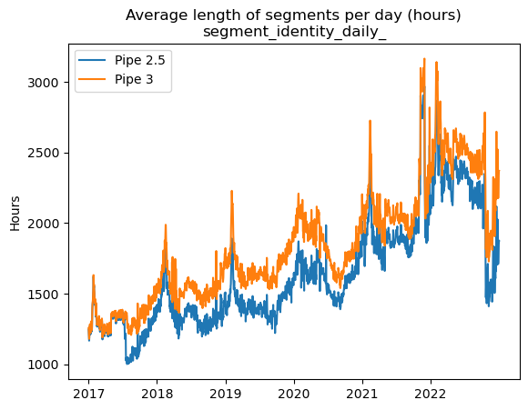
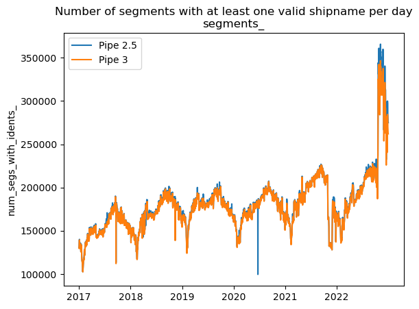
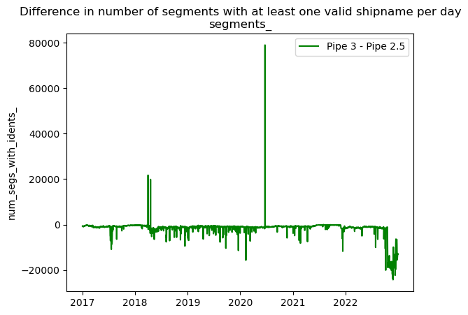
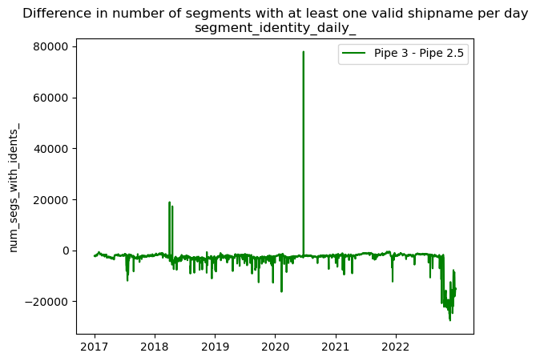
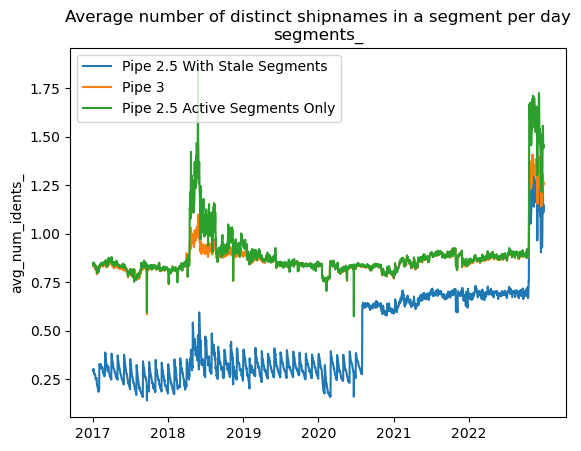
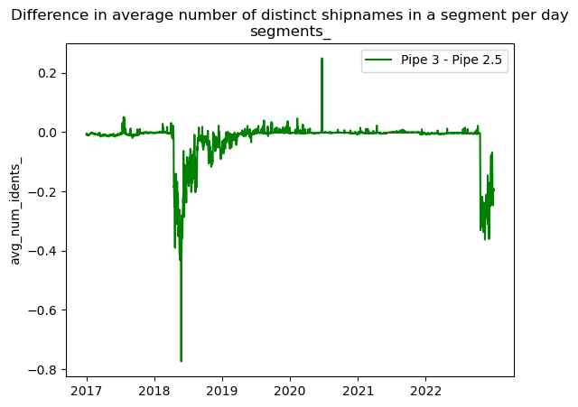
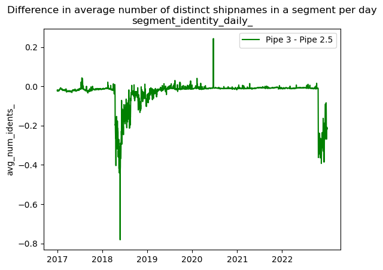
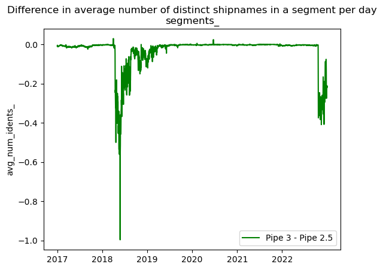

# Segmenter Version Comparison

This notebook calculates and visualizes key segment metrics to allow the user to compare a new pipeline to the old one for QA purposes. This was specifically built to compate pipe 3 to pipe 2.5 and is not guaranteed when using different pipeline versions. Even using a new version of pipe 3 may require some changes if column names have changed.

Author: Jenn Van Osdel  
Last Updated: April 3, 2023


```python
import os
import pandas as pd
import numpy as np
import matplotlib.pyplot as plt

from importlib import reload
import config
reload(config)
from config import DATASET_PIPE3, DATASET_PIPE25, SEGMENTS_TABLE, FRAGMENTS_TABLE, MESSAGES_SEGMENTED_TABLE, SEGMENT_INFO_TABLE, SEGMENT_IDENITY_DAILY_TABLE

START_DATE = '20170101'
END_DATE = '20221231'
pd.set_option("max_rows", 20)

DATA_FOLDER = "data"
if not os.path.exists(DATA_FOLDER):
    os.makedirs(DATA_FOLDER)

FIGURES_FOLDER = "figures"
if not os.path.exists(FIGURES_FOLDER):
    os.makedirs(FIGURES_FOLDER)
```

# Yearly Stats


```python
def get_yearly_segment_stats(segments_table_ref, first_timestamp="first_timestamp", filter_stale_segs=False):

    filter = "WHERE DATE(timestamp) <= DATE(last_msg_timestamp)" if filter_stale_segs else ""

    q = f'''
    WITH

    seg_counts AS (
    SELECT seg_id, EXTRACT(YEAR FROM timestamp) as year, {first_timestamp}, COUNT(*) AS num_days
    FROM `{segments_table_ref}*`
    {filter}
    GROUP BY seg_id, year, {first_timestamp}
    )

    SELECT 
    year,
    COUNT(*) as num_segs, 
    COUNT(DISTINCT seg_id) as num_segs_distinct,
    AVG(num_days) as avg_num_days, 
    MIN(num_days) AS min_num_days, 
    MAX(num_days) AS max_num_days,
    APPROX_QUANTILES(num_days, 2)[OFFSET(1)] AS med_num_days,
    APPROX_QUANTILES(IF(num_days > 1, num_days, NULL), 2 IGNORE NULLS)[OFFSET(1)] AS med_num_days_over1,
    MIN({first_timestamp}) AS earliest_seg_start
    FROM seg_counts
    GROUP BY year
    ORDER BY year
    '''
    # print(q)
    return pd.read_gbq(q, project_id='world-fishing-827', dialect='standard')
```


```python
yearly_stats_pipe3 = get_yearly_segment_stats(f"{DATASET_PIPE3}.{SEGMENTS_TABLE}")
yearly_stats_pipe3.to_csv(f"{DATA_FOLDER}/yearly_stats_pipe3.csv")
yearly_stats_pipe3
```

    /Users/jennifervanosdel/miniconda3/envs/rad/lib/python3.9/site-packages/google/auth/_default.py:81: UserWarning: Your application has authenticated using end user credentials from Google Cloud SDK without a quota project. You might receive a "quota exceeded" or "API not enabled" error. We recommend you rerun `gcloud auth application-default login` and make sure a quota project is added. Or you can use service accounts instead. For more information about service accounts, see https://cloud.google.com/docs/authentication/
      warnings.warn(_CLOUD_SDK_CREDENTIALS_WARNING)


<div>
<style scoped>
    .dataframe tbody tr th:only-of-type {
        vertical-align: middle;
    }

    .dataframe tbody tr th {
        vertical-align: top;
    }

    .dataframe thead th {
        text-align: right;
    }
</style>
<table border="1" class="dataframe">
  <thead>
    <tr style="text-align: right;">
      <th></th>
      <th>year</th>
      <th>num_segs</th>
      <th>num_segs_distinct</th>
      <th>avg_num_days</th>
      <th>min_num_days</th>
      <th>max_num_days</th>
      <th>med_num_days</th>
      <th>med_num_days_over1</th>
      <th>earliest_seg_start</th>
    </tr>
  </thead>
  <tbody>
    <tr>
      <th>0</th>
      <td>2012</td>
      <td>6228813</td>
      <td>6228813</td>
      <td>3.961839</td>
      <td>1</td>
      <td>366</td>
      <td>1</td>
      <td>3</td>
      <td>2012-01-01 00:00:00+00:00</td>
    </tr>
    <tr>
      <th>1</th>
      <td>2013</td>
      <td>13116811</td>
      <td>13116811</td>
      <td>3.421320</td>
      <td>1</td>
      <td>365</td>
      <td>1</td>
      <td>3</td>
      <td>2012-01-01 00:00:03+00:00</td>
    </tr>
    <tr>
      <th>2</th>
      <td>2014</td>
      <td>13569319</td>
      <td>13569319</td>
      <td>3.593424</td>
      <td>1</td>
      <td>365</td>
      <td>1</td>
      <td>3</td>
      <td>2012-01-01 00:00:03+00:00</td>
    </tr>
    <tr>
      <th>3</th>
      <td>2015</td>
      <td>14166806</td>
      <td>14166806</td>
      <td>3.606562</td>
      <td>1</td>
      <td>365</td>
      <td>1</td>
      <td>3</td>
      <td>2012-01-01 00:00:03+00:00</td>
    </tr>
    <tr>
      <th>4</th>
      <td>2016</td>
      <td>15330681</td>
      <td>15330681</td>
      <td>3.889371</td>
      <td>1</td>
      <td>366</td>
      <td>1</td>
      <td>3</td>
      <td>2012-01-01 00:00:58+00:00</td>
    </tr>
    <tr>
      <th>5</th>
      <td>2017</td>
      <td>20440684</td>
      <td>20440684</td>
      <td>3.584740</td>
      <td>1</td>
      <td>365</td>
      <td>1</td>
      <td>3</td>
      <td>2012-01-01 00:00:58+00:00</td>
    </tr>
    <tr>
      <th>6</th>
      <td>2018</td>
      <td>21887231</td>
      <td>21887231</td>
      <td>3.643448</td>
      <td>1</td>
      <td>365</td>
      <td>1</td>
      <td>3</td>
      <td>2012-01-01 00:00:58+00:00</td>
    </tr>
    <tr>
      <th>7</th>
      <td>2019</td>
      <td>21394850</td>
      <td>21394850</td>
      <td>3.886905</td>
      <td>1</td>
      <td>365</td>
      <td>1</td>
      <td>3</td>
      <td>2012-01-01 00:01:34+00:00</td>
    </tr>
    <tr>
      <th>8</th>
      <td>2020</td>
      <td>21624786</td>
      <td>21624786</td>
      <td>3.910735</td>
      <td>1</td>
      <td>366</td>
      <td>1</td>
      <td>3</td>
      <td>2012-01-01 00:04:12+00:00</td>
    </tr>
    <tr>
      <th>9</th>
      <td>2021</td>
      <td>20663976</td>
      <td>20663976</td>
      <td>4.278764</td>
      <td>1</td>
      <td>365</td>
      <td>1</td>
      <td>3</td>
      <td>2012-01-01 00:04:12+00:00</td>
    </tr>
    <tr>
      <th>10</th>
      <td>2022</td>
      <td>22430322</td>
      <td>22430322</td>
      <td>4.395140</td>
      <td>1</td>
      <td>365</td>
      <td>1</td>
      <td>3</td>
      <td>2012-01-01 00:04:12+00:00</td>
    </tr>
    <tr>
      <th>11</th>
      <td>2023</td>
      <td>11645375</td>
      <td>11645375</td>
      <td>4.046501</td>
      <td>1</td>
      <td>144</td>
      <td>1</td>
      <td>3</td>
      <td>2012-01-01 00:04:12+00:00</td>
    </tr>
  </tbody>
</table>
</div>


```python
try:
    assert(np.sum(np.where(yearly_stats_pipe3.num_segs == yearly_stats_pipe3.num_segs_distinct, 0, 1)) == 0)
    print("PASSED: No duplicate seg_ids")
except:
    print("FAILED: Duplicate seg_ids detected")
```

    PASSED: No duplicate seg_ids


```python
yearly_stats_pipe25 = get_yearly_segment_stats(f"{DATASET_PIPE25}.{SEGMENTS_TABLE}", first_timestamp='first_msg_timestamp', filter_stale_segs=True)
yearly_stats_pipe25.to_csv(f"{DATA_FOLDER}/yearly_stats_pipe25.csv")
yearly_stats_pipe25
```


<div>
<style scoped>
    .dataframe tbody tr th:only-of-type {
        vertical-align: middle;
    }

    .dataframe tbody tr th {
        vertical-align: top;
    }

    .dataframe thead th {
        text-align: right;
    }
</style>
<table border="1" class="dataframe">
  <thead>
    <tr style="text-align: right;">
      <th></th>
      <th>year</th>
      <th>num_segs</th>
      <th>num_segs_distinct</th>
      <th>avg_num_days</th>
      <th>min_num_days</th>
      <th>max_num_days</th>
      <th>med_num_days</th>
      <th>med_num_days_over1</th>
      <th>earliest_seg_start</th>
    </tr>
  </thead>
  <tbody>
    <tr>
      <th>0</th>
      <td>2012</td>
      <td>6251758</td>
      <td>6251758</td>
      <td>3.967792</td>
      <td>1</td>
      <td>366</td>
      <td>1</td>
      <td>3</td>
      <td>2012-01-01 00:00:00+00:00</td>
    </tr>
    <tr>
      <th>1</th>
      <td>2013</td>
      <td>13165946</td>
      <td>13165946</td>
      <td>3.405986</td>
      <td>1</td>
      <td>365</td>
      <td>1</td>
      <td>3</td>
      <td>2012-01-01 00:00:03+00:00</td>
    </tr>
    <tr>
      <th>2</th>
      <td>2014</td>
      <td>13598588</td>
      <td>13598588</td>
      <td>3.583210</td>
      <td>1</td>
      <td>365</td>
      <td>1</td>
      <td>3</td>
      <td>2012-01-01 00:00:03+00:00</td>
    </tr>
    <tr>
      <th>3</th>
      <td>2015</td>
      <td>14379308</td>
      <td>14379308</td>
      <td>3.558141</td>
      <td>1</td>
      <td>365</td>
      <td>1</td>
      <td>3</td>
      <td>2012-01-01 00:00:03+00:00</td>
    </tr>
    <tr>
      <th>4</th>
      <td>2016</td>
      <td>15678527</td>
      <td>15678527</td>
      <td>3.812399</td>
      <td>1</td>
      <td>366</td>
      <td>1</td>
      <td>3</td>
      <td>2012-01-01 00:00:03+00:00</td>
    </tr>
    <tr>
      <th>5</th>
      <td>2017</td>
      <td>21238433</td>
      <td>21238433</td>
      <td>3.477121</td>
      <td>1</td>
      <td>365</td>
      <td>1</td>
      <td>3</td>
      <td>2012-01-01 00:00:58+00:00</td>
    </tr>
    <tr>
      <th>6</th>
      <td>2018</td>
      <td>22927589</td>
      <td>22927589</td>
      <td>3.511011</td>
      <td>1</td>
      <td>365</td>
      <td>1</td>
      <td>3</td>
      <td>2012-01-01 00:00:58+00:00</td>
    </tr>
    <tr>
      <th>7</th>
      <td>2019</td>
      <td>22472604</td>
      <td>22472604</td>
      <td>3.741668</td>
      <td>1</td>
      <td>365</td>
      <td>1</td>
      <td>3</td>
      <td>2012-01-01 00:01:34+00:00</td>
    </tr>
    <tr>
      <th>8</th>
      <td>2020</td>
      <td>22343931</td>
      <td>22343931</td>
      <td>3.805185</td>
      <td>1</td>
      <td>366</td>
      <td>1</td>
      <td>3</td>
      <td>2012-01-01 00:04:45+00:00</td>
    </tr>
    <tr>
      <th>9</th>
      <td>2021</td>
      <td>21123305</td>
      <td>21123305</td>
      <td>4.200547</td>
      <td>1</td>
      <td>365</td>
      <td>1</td>
      <td>3</td>
      <td>2012-01-01 00:04:45+00:00</td>
    </tr>
    <tr>
      <th>10</th>
      <td>2022</td>
      <td>24491047</td>
      <td>24491047</td>
      <td>4.097240</td>
      <td>1</td>
      <td>365</td>
      <td>1</td>
      <td>3</td>
      <td>2012-01-01 00:12:25+00:00</td>
    </tr>
    <tr>
      <th>11</th>
      <td>2023</td>
      <td>16012604</td>
      <td>16012604</td>
      <td>3.373379</td>
      <td>1</td>
      <td>156</td>
      <td>1</td>
      <td>3</td>
      <td>2012-01-01 00:12:25+00:00</td>
    </tr>
  </tbody>
</table>
</div>


## Daily Segment Metrics

*NOTE: this query is not fully flexible on dates and still assumes all data is within 2020 as hardcoding "2020" into the table suffix decreased query costs by ~95%. You may need to modify the query and check costs if running a period outside of 2020.*


```python
q = f'''

WITH 

segment_data_new AS (
    SELECT 
    DATE(seg.timestamp) AS date,
    EXTRACT(YEAR from DATE(seg.timestamp)) AS year,
    COUNT(*) AS num_segs,
    COUNT(DISTINCT seg_id) AS num_segs_distinct,
    SUM(TIMESTAMP_DIFF(frag.last_msg_timestamp, seg.first_timestamp, MINUTE)/60.0) AS sum_seg_length_h,
    SUM(TIMESTAMP_DIFF(frag.last_msg_timestamp, frag.first_msg_timestamp, MINUTE)/60.0) AS sum_seg_day_length_h,
    SUM(IF(num_idents > 0, 1, 0)) as num_segs_with_idents,
    MIN(num_idents) as min_num_idents,
    MAX(num_idents) as max_num_idents,
    AVG(num_idents) as avg_num_idents,
    SUM(daily_msg_count) as total_msg_count,
    SUM(cumulative_msg_count) as total_cumul_msg_count,
    FROM 
        (SELECT *, (SELECT COUNT(DISTINCT id.shipname) FROM UNNEST(daily_identities) AS id WHERE id.shipname IS NOT NULL) as num_idents
        FROM `{DATASET_PIPE3}.{SEGMENTS_TABLE}*`
        WHERE _TABLE_SUFFIX BETWEEN '{START_DATE}' AND '{END_DATE}')
        AS seg
    JOIN 
        (SELECT * FROM `{DATASET_PIPE3}.{FRAGMENTS_TABLE}*`
        WHERE _TABLE_SUFFIX BETWEEN '{START_DATE}' AND '{END_DATE}')
        AS frag
    USING(frag_id)
    GROUP BY date, year
),

segment_data_old AS (
      SELECT 
    DATE(timestamp) as date,
    EXTRACT(YEAR from DATE(timestamp)) as year,
    COUNTIF(is_active) AS num_segs,
    COUNT(DISTINCT(CASE WHEN is_active THEN seg_id ELSE NULL END)) AS num_segs_distinct,
    COUNTIF(NOT is_active) AS num_segs_stale,
    COUNT(*) AS num_segs_with_stale,
    SUM(TIMESTAMP_DIFF(last_msg_of_day_timestamp, first_msg_timestamp, MINUTE)/60.0) as sum_seg_length_h,
    SUM(TIMESTAMP_DIFF(last_msg_of_day_timestamp, first_msg_of_day_timestamp, MINUTE)/60.0) AS sum_seg_day_length_h,
    SUM(IF(num_idents > 0, 1, 0)) as num_segs_with_idents,
    MIN(num_idents) as min_num_idents,
    MAX(num_idents) as max_num_idents,
    AVG(num_idents) as avg_num_idents,
    SUM(message_count) as total_msg_count,
    FROM 
        (SELECT
            *,
            DATE(timestamp) <= DATE(last_msg_timestamp) as is_active,
            (SELECT COUNTIF(shipname IS NOT NULL) FROM UNNEST (shipnames) AS shipname) as num_idents
        FROM `{DATASET_PIPE25}.{SEGMENTS_TABLE}*`
        WHERE _TABLE_SUFFIX BETWEEN '{START_DATE}' AND '{END_DATE}')
    GROUP BY date, year
),

segment_join AS (
    SELECT
    date,
    year,
    IFNULL(segs_new.num_segs, 0) AS num_segs_new,
    IFNULL(segs_new.num_segs_distinct, 0) AS num_segs_distinct_new,
    IFNULL(segs_new.sum_seg_length_h, 0) AS sum_seg_length_h_new,
    IFNULL(segs_new.sum_seg_day_length_h, 0) AS sum_seg_day_length_h_new,
    segs_new.num_segs_with_idents AS num_segs_with_idents_new,
    segs_new.min_num_idents AS min_num_idents_new,
    segs_new.max_num_idents AS max_num_idents_new,
    segs_new.avg_num_idents AS avg_num_idents_new,
    segs_new.total_msg_count AS total_msg_count_new,
    segs_new.total_cumul_msg_count AS total_cumul_msg_count_new,
    IFNULL(segs_old.num_segs, 0) AS num_segs_old,
    IFNULL(segs_old.num_segs_distinct, 0) AS num_segs_distinct_old,
    IFNULL(segs_old.num_segs_stale, 0) AS num_segs_stale_old,
    IFNULL(segs_old.num_segs_with_stale, 0) AS num_segs_with_stale_old,
    IFNULL(segs_old.sum_seg_length_h, 0) AS sum_seg_length_h_old,
    IFNULL(segs_old.sum_seg_day_length_h, 0) AS sum_seg_day_length_h_old,
    segs_old.min_num_idents AS min_num_idents_old,
    segs_old.max_num_idents AS max_num_idents_old,
    segs_old.avg_num_idents AS avg_num_idents_old,
    segs_old.num_segs_with_idents AS num_segs_with_idents_old,
    segs_old.total_msg_count AS total_msg_count_old,
    FROM segment_data_new segs_new
    FULL OUTER JOIN segment_data_old segs_old
    USING(date, year)
    ORDER BY date
)

SELECT
date,
year,
num_segs_new,
num_segs_distinct_new,
sum_seg_length_h_new,
sum_seg_day_length_h_new,
num_segs_with_idents_new,
min_num_idents_new,
max_num_idents_new,
avg_num_idents_new,
total_msg_count_new,
total_cumul_msg_count_new,
num_segs_old,
num_segs_distinct_old,
num_segs_stale_old,
num_segs_with_stale_old,
sum_seg_length_h_old,
sum_seg_day_length_h_old,
num_segs_with_idents_old,
min_num_idents_old,
max_num_idents_old,
avg_num_idents_old,
total_msg_count_old,
(num_segs_new - num_segs_old) as num_segs_diff,
(num_segs_distinct_new - num_segs_distinct_old) as num_segs_distinct_diff,
(sum_seg_length_h_new - sum_seg_length_h_old) as sum_seg_length_h_diff,
(sum_seg_day_length_h_new - sum_seg_day_length_h_old) as sum_seg_day_length_h_diff,
(num_segs_with_idents_new - num_segs_with_idents_old) as num_segs_with_idents_diff,
(min_num_idents_new - min_num_idents_old) as min_num_idents_diff,
(max_num_idents_new - max_num_idents_old) as max_num_idents_diff,
(avg_num_idents_new - avg_num_idents_old) as avg_num_idents_diff,
(total_msg_count_new - total_msg_count_old) as total_msg_count_diff,
FROM segment_join
'''

# print(q)
df_segs_daily = pd.read_gbq(q, project_id='world-fishing-827', dialect='standard')
df_segs_daily.date = pd.to_datetime(df_segs_daily.date)

df_segs_daily['avg_seg_length_h_new'] = df_segs_daily.sum_seg_length_h_new / df_segs_daily.num_segs_distinct_new
df_segs_daily['avg_seg_length_h_old'] = df_segs_daily.sum_seg_length_h_old / df_segs_daily.num_segs_distinct_old
df_segs_daily['avg_seg_length_h_diff'] = df_segs_daily.avg_seg_length_h_new - df_segs_daily.avg_seg_length_h_old
df_segs_daily['prop_segs_with_idents_new'] = df_segs_daily.num_segs_with_idents_new / df_segs_daily.num_segs_new
df_segs_daily['prop_segs_with_idents_old'] = df_segs_daily.num_segs_with_idents_old / df_segs_daily.num_segs_old
df_segs_daily['prop_segs_with_idents_diff'] = df_segs_daily.num_segs_with_idents_new - df_segs_daily.num_segs_with_idents_old

# Quick checks for duplicate seg_id and that counts of active and state add up for Pipe 2.5
assert(df_segs_daily[df_segs_daily.num_segs_new != df_segs_daily.num_segs_distinct_new].shape[0] == 0)
assert(df_segs_daily[(df_segs_daily.num_segs_old + df_segs_daily.num_segs_stale_old) != df_segs_daily.num_segs_with_stale_old].shape[0] == 0)
```


```python
q = f'''
WITH 

segment_data_new AS (
    SELECT 
    DATE(first_timestamp) AS date,
    EXTRACT(YEAR from DATE(first_timestamp)) AS year,
    COUNT(*) AS num_segs,
    COUNT(DISTINCT seg_id) AS num_segs_distinct,
    SUM(TIMESTAMP_DIFF(last_pos_timestamp, TIMESTAMP(SUBSTRING(seg_id, STRPOS(seg_id, '-') + 1, LENGTH(seg_id) - STRPOS(seg_id, '-') - STRPOS(REVERSE(seg_id), '-'))), MINUTE)/60.0) AS sum_seg_length_h,
    SUM(TIMESTAMP_DIFF(last_pos_timestamp, first_pos_timestamp, MINUTE)/60.0) AS sum_seg_day_length_h,
    SUM(IF(num_idents > 0, 1, 0)) as num_segs_with_idents,
    MIN(num_idents) as min_num_idents,
    MAX(num_idents) as max_num_idents,
    AVG(num_idents) as avg_num_idents,
    SUM(msg_count) as total_msg_count,
    SUM(pos_count) as total_pos_count,
    SUM(ident_count) as total_ident_count,
    FROM 
        (SELECT *, (SELECT COUNTIF(shipname IS NOT NULL) FROM UNNEST (shipname) AS shipname) as num_idents
        FROM `{DATASET_PIPE3}.{SEGMENT_IDENITY_DAILY_TABLE}*`
        WHERE _TABLE_SUFFIX BETWEEN '{START_DATE}' AND '{END_DATE}')
    GROUP BY date, year
),

segment_data_old AS (
    SELECT 
    DATE(first_timestamp) as date,
    EXTRACT(YEAR from DATE(first_timestamp)) as year,
    COUNT(*) AS num_segs,
    COUNT(DISTINCT seg_id) AS num_segs_distinct,
    SUM(TIMESTAMP_DIFF(last_pos_timestamp, TIMESTAMP(RIGHT(seg_id, LENGTH(seg_id) - STRPOS(seg_id, '-'))), MINUTE)/60.0) AS sum_seg_length_h,
    SUM(TIMESTAMP_DIFF(last_pos_timestamp, first_pos_timestamp, MINUTE)/60.0) AS sum_seg_day_length_h,
    SUM(IF(num_idents > 0, 1, 0)) as num_segs_with_idents,
    MIN(num_idents) as min_num_idents,
    MAX(num_idents) as max_num_idents,
    AVG(num_idents) as avg_num_idents,
    SUM(msg_count) as total_msg_count,
    SUM(pos_count) as total_pos_count,
    SUM(ident_count) as total_ident_count,
    FROM 
        (SELECT *, (SELECT COUNTIF(shipname IS NOT NULL) FROM UNNEST (shipname) AS shipname) as num_idents
        FROM `{DATASET_PIPE25}.{SEGMENT_IDENITY_DAILY_TABLE}*`
        WHERE _TABLE_SUFFIX BETWEEN '{START_DATE}' AND '{END_DATE}')
    GROUP BY date, year
),

segment_join AS (
    SELECT
    date,
    year,
    IFNULL(segs_new.num_segs, 0) AS num_segs_new,
    IFNULL(segs_new.num_segs_distinct, 0) AS num_segs_distinct_new,
    IFNULL(segs_new.sum_seg_length_h, 0) AS sum_seg_length_h_new,
    IFNULL(segs_new.sum_seg_day_length_h, 0) AS sum_seg_day_length_h_new,
    segs_new.num_segs_with_idents AS num_segs_with_idents_new,
    segs_new.min_num_idents AS min_num_idents_new,
    segs_new.max_num_idents AS max_num_idents_new,
    segs_new.avg_num_idents AS avg_num_idents_new,
    segs_new.total_msg_count AS total_msg_count_new,
    segs_new.total_pos_count AS total_pos_count_new,
    segs_new.total_ident_count AS total_ident_count_new,
    IFNULL(segs_old.num_segs, 0) AS num_segs_old,
    IFNULL(segs_old.num_segs_distinct, 0) AS num_segs_distinct_old,
    IFNULL(segs_old.sum_seg_length_h, 0) AS sum_seg_length_h_old,
    IFNULL(segs_old.sum_seg_day_length_h, 0) AS sum_seg_day_length_h_old,
    segs_old.min_num_idents AS min_num_idents_old,
    segs_old.max_num_idents AS max_num_idents_old,
    segs_old.avg_num_idents AS avg_num_idents_old,
    segs_old.num_segs_with_idents AS num_segs_with_idents_old,
    segs_old.total_msg_count AS total_msg_count_old,
    segs_old.total_pos_count AS total_pos_count_old,
    segs_old.total_ident_count AS total_ident_count_old,
    FROM segment_data_new segs_new
    FULL OUTER JOIN segment_data_old segs_old
    USING(date, year)
    ORDER BY date
)

SELECT
date,
year,
num_segs_new,
num_segs_distinct_new,
sum_seg_length_h_new,
sum_seg_day_length_h_new,
num_segs_with_idents_new,
min_num_idents_new,
max_num_idents_new,
avg_num_idents_new,
total_msg_count_new,
total_pos_count_new,
total_ident_count_new,
num_segs_old,
num_segs_distinct_old,
sum_seg_length_h_old,
sum_seg_day_length_h_old,
num_segs_with_idents_old,
min_num_idents_old,
max_num_idents_old,
avg_num_idents_old,
total_msg_count_old,
total_pos_count_old,
total_ident_count_old,
(num_segs_new - num_segs_old) as num_segs_diff,
(num_segs_distinct_new - num_segs_distinct_old) as num_segs_distinct_diff,
(sum_seg_length_h_new - sum_seg_length_h_old) as sum_seg_length_h_diff,
(sum_seg_day_length_h_new - sum_seg_day_length_h_old) as sum_seg_day_length_h_diff,
(num_segs_with_idents_new - num_segs_with_idents_old) as num_segs_with_idents_diff,
(min_num_idents_new - min_num_idents_old) as min_num_idents_diff,
(max_num_idents_new - max_num_idents_old) as max_num_idents_diff,
(avg_num_idents_new - avg_num_idents_old) as avg_num_idents_diff,
(total_msg_count_new - total_msg_count_old) as total_msg_count_diff,
(total_pos_count_new - total_pos_count_old) as total_pos_count_diff,
(total_ident_count_new - total_ident_count_old) as total_ident_count_diff,
FROM segment_join
'''

# print(q)
df_seg_identity_daily = pd.read_gbq(q, project_id='world-fishing-827', dialect='standard')
df_seg_identity_daily.drop(df_seg_identity_daily[df_seg_identity_daily.date.isnull()].index, inplace=True)
df_seg_identity_daily.date = pd.to_datetime(df_seg_identity_daily.date)

df_seg_identity_daily['avg_seg_length_h_new'] = df_seg_identity_daily.sum_seg_length_h_new / df_seg_identity_daily.num_segs_distinct_new
df_seg_identity_daily['avg_seg_length_h_old'] = df_seg_identity_daily.sum_seg_length_h_old / df_seg_identity_daily.num_segs_distinct_old
df_seg_identity_daily['avg_seg_length_h_diff'] = df_seg_identity_daily.avg_seg_length_h_new - df_seg_identity_daily.avg_seg_length_h_old
df_seg_identity_daily['prop_segs_with_idents_new'] = df_seg_identity_daily.num_segs_with_idents_new / df_seg_identity_daily.num_segs_new
df_seg_identity_daily['prop_segs_with_idents_old'] = df_seg_identity_daily.num_segs_with_idents_old / df_seg_identity_daily.num_segs_old
df_seg_identity_daily['prop_segs_with_idents_diff'] = df_seg_identity_daily.num_segs_with_idents_new - df_seg_identity_daily.num_segs_with_idents_old

# Quick checks for duplicate seg_id
assert(df_seg_identity_daily[df_seg_identity_daily.num_segs_new != df_seg_identity_daily.num_segs_distinct_new].shape[0] == 0)
```

#### Save data for reference


```python
df_segs_daily.to_csv(f"{DATA_FOLDER}/daily_stats_segments.csv")
df_seg_identity_daily.to_csv(f"{DATA_FOLDER}/daily_stats_segment_identity_daily.csv")
```


```python
def plot_new_vs_old(df, col_prefix, title, ylabel="", outfile=None):
    fig = plt.figure()
    ax = df[[f'{col_prefix}old']].plot(label='old')
    df[[f'{col_prefix}new']].plot(label='new', ax=ax)
    years = list(df.year.sort_values().unique())
    ax.set_xticks([t*365 for t in range(len(years))])
    ax.set_xticklabels(years)
    fig.patch.set_facecolor('white')
    ax.legend(["Pipe 2.5", "Pipe 3"])
    plt.title(title)
    plt.ylabel(ylabel)

    if outfile:
        plt.savefig(f"{FIGURES_FOLDER}/{outfile}", dpi=180)
        
    return fig, ax


```


```python
def plot_diff(df, col_prefix, title, ylabel="", outfile=None):
    fig = plt.figure()
    ax = df[[f'{col_prefix}diff']].plot(c='green', label='diff')
    years = list(df.year.sort_values().unique())
    ax.set_xticks([t*365 for t in range(len(years))])
    ax.set_xticklabels(years)
    fig.patch.set_facecolor('white')
    ax.legend(["Pipe 3 - Pipe 2.5"])
    plt.title(title)
    plt.ylabel(ylabel)

    if outfile:
        plt.savefig(f"{FIGURES_FOLDER}/{outfile}", dpi=180)
        
    return fig, ax


```

#### Number of segments active in each day

`num_segs`

Note: distinctness of `seg_id`s was checked in an assertion during data pull so we can ignore the `num_segs_distinct` column.


```python
fig, ax = plot_new_vs_old(df_segs_daily, col_prefix='num_segs_', 
                title="Number of active segments per day\nsegments_",
                ylabel="num_segs")
df_segs_daily[[f'num_segs_with_stale_old']].plot(label='Pipe 2.5 Stale', ax=ax)
ax.legend(["Pipe 2.5", "Pipe 3", "Pipe 2.5 With Stale Segments"])
plt.savefig(f"{FIGURES_FOLDER}/1_num_segs_segments.png", dpi=180)


plot_diff(df_segs_daily, col_prefix='num_segs_', 
          title="Difference in number of active segments per day\nsegments_",
          ylabel="num_segs", outfile="2_num_segs_diff_segments.png")

plot_new_vs_old(df_seg_identity_daily, col_prefix='num_segs_', 
                title="Number of active segments per day\nsegment_identity_daily_",
                ylabel="num_segs", outfile="3_num_segs_segment_identity_daily.png")

plot_diff(df_seg_identity_daily, col_prefix='num_segs_', 
          title="Difference in number of active_segments per day\nsegment_identity_daily_",
          ylabel="num_segs", outfile="4_num_segs_diff_segment_identity_daily.png")
```


    (<Figure size 640x480 with 0 Axes>,
     <AxesSubplot:title={'center':'Difference in number of active_segments per day\nsegment_identity_daily_'}, ylabel='num_segs'>)


    <Figure size 640x480 with 0 Axes>


    

    


    <Figure size 640x480 with 0 Axes>


    

    


    <Figure size 640x480 with 0 Axes>


    

    


    <Figure size 640x480 with 0 Axes>


    

    


#### Total cumulative length of segments active in each day (hours)

`sum_seg_length_h`


```python
plot_new_vs_old(df_segs_daily, col_prefix='sum_seg_length_h_', 
                      title="Total cumulative length of segments active in each day (hours)\nsegments_",
                      ylabel="Hours", outfile="5_sum_seg_length_h_segments.png")

plot_diff(df_segs_daily, col_prefix='sum_seg_length_h_', 
          title="Difference in total cumulative length of segments active in each day\nsegments_",
          ylabel="Hours", outfile="6_sum_seg_length_h_diff_segments.png")

plot_new_vs_old(df_seg_identity_daily, col_prefix='sum_seg_length_h_', 
                      title="Total cumulative length of segments active in each day (hours)\nsegment_identity_daily_",
                      ylabel="Hours", outfile="7_sum_seg_length_h_segment_identity_daily.png")

plot_diff(df_seg_identity_daily, col_prefix='sum_seg_length_h_', 
          title="Difference in total cumulative length of segments active in each day\nsegment_identity_daily_",
          ylabel="Hours", outfile="8_sum_seg_length_h_diff_segment_identity_daily.png")
```


    (<Figure size 640x480 with 0 Axes>,
     <AxesSubplot:title={'center':'Difference in total cumulative length of segments active in each day\nsegment_identity_daily_'}, ylabel='Hours'>)


    <Figure size 640x480 with 0 Axes>


    

    


    <Figure size 640x480 with 0 Axes>


    

    


    <Figure size 640x480 with 0 Axes>


    

    


    <Figure size 640x480 with 0 Axes>


    

    


#### Sum of all segment lengths within each day (hours)

`sum_seg_day_length_h_`


```python
plot_new_vs_old(df_segs_daily, col_prefix='sum_seg_day_length_h_', 
                      title="Total length of segments within each day (hours)\nsegments_",
                      ylabel="Hours", outfile="9_sum_seg_day_length_h_segments.png")

plot_diff(df_segs_daily, col_prefix='sum_seg_day_length_h_', 
          title="Difference in total length of segments within each day\nsegments_",
          ylabel="Hours", outfile="10_sum_seg_day_length_h_diff_segments.png")

plot_new_vs_old(df_seg_identity_daily, col_prefix='sum_seg_day_length_h_', 
                      title="Total length of segments within each day (hours)\nsegment_identity_daily_",
                      ylabel="Hours", outfile="11_sum_seg_day_length_h_segment_identity_daily.png")

plot_diff(df_seg_identity_daily, col_prefix='sum_seg_day_length_h_', 
          title="Difference in total length of segments within each day\nsegment_identity_daily_",
          ylabel="Hours", outfile="12_sum_seg_day_length_h_diff_segment_identity_daily.png")
```


    (<Figure size 640x480 with 0 Axes>,
     <AxesSubplot:title={'center':'Difference in total length of segments within each day\nsegment_identity_daily_'}, ylabel='Hours'>)


    <Figure size 640x480 with 0 Axes>


    

    


    <Figure size 640x480 with 0 Axes>


    

    


    <Figure size 640x480 with 0 Axes>


    

    


    <Figure size 640x480 with 0 Axes>


    

    


#### Average segment length per day (hours)

`sum_seg_length_h_`


```python
plot_new_vs_old(df_segs_daily, col_prefix='avg_seg_length_h_', 
                      title="Average length of segments per day (hours)\nsegments_",
                      ylabel="Hours", outfile="13_avg_seg_length_h_segments.png")

plot_diff(df_segs_daily, col_prefix='avg_seg_length_h_', 
          title="Difference in average length of segment per day\nsegments_",
          ylabel="Hours", outfile="14_avg_seg_length_h_diff_segments.png")

plot_new_vs_old(df_seg_identity_daily, col_prefix='avg_seg_length_h_', 
                      title="Average length of segments per day (hours)\nsegment_identity_daily_",
                      ylabel="Hours", outfile="15_avg_seg_length_h_segment_identity_daily.png")

plot_diff(df_seg_identity_daily, col_prefix='avg_seg_length_h_', 
          title="Difference in average length of segment per day\nsegment_identity_daily_",
          ylabel="Hours", outfile="16_avg_seg_length_h_diff_segment_identity_daily.png")
```


    (<Figure size 640x480 with 0 Axes>,
     <AxesSubplot:title={'center':'Difference in average length of segment per day\nsegment_identity_daily_'}, ylabel='Hours'>)


    <Figure size 640x480 with 0 Axes>


    

    


    <Figure size 640x480 with 0 Axes>


    

    


    <Figure size 640x480 with 0 Axes>


    

    


    <Figure size 640x480 with 0 Axes>


    

    


```python

```


```python
fig = plot_new_vs_old(df_segs_daily, col_prefix='num_segs_with_idents_', 
                      title="Number of segments with at least one valid shipname\nAll MMSI",
                      ylabel="Number of segments")
```


    <Figure size 640x480 with 0 Axes>


    

    


#### Number of segment with at least one valid shipname

`num_segs_with_idents_`


```python
plot_new_vs_old(df_segs_daily, col_prefix='num_segs_with_idents_', 
                      title="Number of segments with at least one valid shipname per day\nsegments_",
                      ylabel="num_segs_with_idents_", outfile="17_num_segs_with_idents_segments.png")

plot_diff(df_segs_daily, col_prefix='num_segs_with_idents_', 
          title="Difference in number of segments with at least one valid shipname per day\nsegments_",
          ylabel="num_segs_with_idents_", outfile="18_num_segs_with_idents_diff_segments.png")

plot_new_vs_old(df_seg_identity_daily, col_prefix='num_segs_with_idents_', 
                      title="Number of segments with at least one valid shipname per day\nsegment_identity_daily_",
                      ylabel="num_segs_with_idents_", outfile="19_num_segs_with_idents_segment_identity_daily.png")

plot_diff(df_seg_identity_daily, col_prefix='num_segs_with_idents_', 
          title="Difference in number of segments with at least one valid shipname per day\nsegment_identity_daily_",
          ylabel="num_segs_with_idents_", outfile="20_num_segs_with_idents_diff_segment_identity_daily.png")
```


    (<Figure size 640x480 with 0 Axes>,
     <AxesSubplot:title={'center':'Difference in number of segments with at least one valid shipname per day\nsegment_identity_daily_'}, ylabel='num_segs_with_idents_'>)


    <Figure size 640x480 with 0 Axes>


    

    


    <Figure size 640x480 with 0 Axes>


    

    


    <Figure size 640x480 with 0 Axes>


    

    


    <Figure size 640x480 with 0 Axes>


    

    


#### Proportion of segments with at least one valid shipname

`prop_segs_with_idents_`


```python
plot_new_vs_old(df_segs_daily, col_prefix='prop_segs_with_idents_', 
                      title="Proportion of segments with at least one valid shipname per day\nsegments_",
                      ylabel="prop_segs_with_idents_", outfile="21_prop_segs_with_idents_segments.png")

plot_diff(df_segs_daily, col_prefix='prop_segs_with_idents_', 
          title="Difference in proportion of segments with at least one valid shipname per day\nsegments_",
          ylabel="prop_segs_with_idents_", outfile="22_prop_segs_with_idents_diff_segments.png")

plot_new_vs_old(df_seg_identity_daily, col_prefix='prop_segs_with_idents_', 
                      title="Proportion of segments with at least one valid shipname per day\nsegment_identity_daily_",
                      ylabel="prop_segs_with_idents_", outfile="23_prop_segs_with_idents_segment_identity_daily.png")

plot_diff(df_seg_identity_daily, col_prefix='prop_segs_with_idents_', 
          title="Difference in proportion of segments with at least one valid shipname per day\nsegment_identity_daily_",
          ylabel="prop_segs_with_idents_", outfile="24_prop_segs_with_idents_diff_segment_identity_daily.png")
```


    (<Figure size 640x480 with 0 Axes>,
     <AxesSubplot:title={'center':'Difference in proportion of segments with at least one valid shipname per day\nsegment_identity_daily_'}, ylabel='prop_segs_with_idents_'>)


    <Figure size 640x480 with 0 Axes>


    

    


    <Figure size 640x480 with 0 Axes>


    

    


    <Figure size 640x480 with 0 Axes>


    

    


    <Figure size 640x480 with 0 Axes>


    

    


#### Average number of distinct shipnames in a segment per day

`avg_num_idents_`


```python
plot_new_vs_old(df_segs_daily, col_prefix='avg_num_idents_', 
                      title="Average number of distinct shipnames in a segment per day\nsegments_",
                      ylabel="avg_num_idents_", outfile="25_avg_num_idents_segments.png")

plot_diff(df_segs_daily, col_prefix='avg_num_idents_', 
          title="Difference in average number of distinct shipnames in a segment per day\nsegments_",
          ylabel="avg_num_idents_", outfile="26_avg_num_idents_diff_segments.png")

plot_new_vs_old(df_seg_identity_daily, col_prefix='avg_num_idents_', 
                      title="Average number of distinct shipnames in a segment per day\nsegment_identity_daily_",
                      ylabel="avg_num_idents_", outfile="27_avg_num_idents_segment_identity_daily.png")

plot_diff(df_seg_identity_daily, col_prefix='avg_num_idents_', 
          title="Difference in average number of distinct shipnames in a segment per day\nsegment_identity_daily_",
          ylabel="avg_num_idents_", outfile="28_avg_num_idents_diff_segment_identity_daily.png")
```


    (<Figure size 640x480 with 0 Axes>,
     <AxesSubplot:title={'center':'Difference in average number of distinct shipnames in a segment per day\nsegment_identity_daily_'}, ylabel='avg_num_idents_'>)


    <Figure size 640x480 with 0 Axes>


    

    


    <Figure size 640x480 with 0 Axes>


    

    


    <Figure size 640x480 with 0 Axes>


    

    


    <Figure size 640x480 with 0 Axes>


    

    


#### Maximum number of distinct shipnames in a segment per day

`max_num_idents_`


```python
plot_new_vs_old(df_segs_daily, col_prefix='max_num_idents_', 
                      title="Maximum number of distinct shipnames in a segment per day\nsegments_",
                      ylabel="max_num_idents_", outfile="29_max_num_idents_segments.png")

plot_diff(df_segs_daily, col_prefix='max_num_idents_', 
          title="Difference in maximum number of distinct shipnames in a segment per day\nsegments_",
          ylabel="max_num_idents_", outfile="30_max_num_idents_diff_segments.png")

plot_new_vs_old(df_seg_identity_daily, col_prefix='max_num_idents_', 
                      title="Maximum number of distinct shipnames in a segment per day\nsegment_identity_daily_",
                      ylabel="max_num_idents_", outfile="31_max_num_idents_segment_identity_daily.png")

plot_diff(df_seg_identity_daily, col_prefix='max_num_idents_', 
          title="Difference in maximum number of distinct shipnames in a segment per day\nsegment_identity_daily_",
          ylabel="max_num_idents_", outfile="32_max_num_idents_diff_segment_identity_daily.png")
```


    (<Figure size 640x480 with 0 Axes>,
     <AxesSubplot:title={'center':'Difference in maximum number of distinct shipnames in a segment per day\nsegment_identity_daily_'}, ylabel='max_num_idents_'>)


    <Figure size 640x480 with 0 Axes>


    

    


    <Figure size 640x480 with 0 Axes>


    

    


    <Figure size 640x480 with 0 Axes>


    

    


    <Figure size 640x480 with 0 Axes>


    

    


#### Total message count per day

`total_msg_count_`


```python
plot_new_vs_old(df_segs_daily, col_prefix='total_msg_count_', 
                      title="Total message count per day\nsegments_",
                      ylabel="total_msg_count_", outfile="33_total_msg_count_segments.png")

plot_diff(df_segs_daily, col_prefix='total_msg_count_', 
          title="Difference in total message count per day\nsegments_",
          ylabel="total_msg_count_", outfile="34_total_msg_count_diff_segments.png")

plot_new_vs_old(df_seg_identity_daily, col_prefix='total_msg_count_', 
                      title="Total message count per day\nsegment_identity_daily_",
                      ylabel="total_msg_count_", outfile="35_total_msg_count_segment_identity_daily.png")

plot_diff(df_seg_identity_daily, col_prefix='total_msg_count_', 
          title="Difference in total message count per day\nsegment_identity_daily_",
          ylabel="total_msg_count_", outfile="36_total_msg_count_diff_segment_identity_daily.png")
```


    (<Figure size 640x480 with 0 Axes>,
     <AxesSubplot:title={'center':'Difference in total message count per day\nsegment_identity_daily_'}, ylabel='total_msg_count_'>)


    <Figure size 640x480 with 0 Axes>


    

    


    <Figure size 640x480 with 0 Axes>


    

    


    <Figure size 640x480 with 0 Axes>


    

    


    <Figure size 640x480 with 0 Axes>


    

    


#### Discrepancies in message count between pipe 2.5 and pipe 3

In both the `segments_` and `segments_identity_daily_` tables, pipe 2.5 message counts are _cumulative_. In Pipe 3, the `segments_` table now has two separate columns, `daily_msg_count` and `cumulative_msg_count`. The `segment_identity_table` only uses `daily_msg_count` to set its `message_count` field meaning there is no cumulative field to compare to that table in pipe 2.5.

All of the figures in the previous section are calculated with the cumulative message count in pipe 2.5 (which is the only one available) and the daily message count in pipe 3. But in the `segments_` table we can still compare cumulative message counts for each day so we do that below. 


```python
fig = plt.figure()
ax = df_segs_daily[[f'total_msg_count_old']].plot(label='old')
df_segs_daily[[f'total_cumul_msg_count_new']].plot(label='new', ax=ax)
years = list(df_segs_daily.year.sort_values().unique())
ax.set_xticks([t*365 for t in range(len(years))])
ax.set_xticklabels(years)
fig.patch.set_facecolor('white')
ax.legend(["Pipe 2.5", "Pipe 3"])
plt.title("Total cumulative messages counts per day\nsegments_")

plt.savefig(f"{FIGURES_FOLDER}/37_total_cumul_msg_count_segments.png", dpi=180)
```


    <Figure size 640x480 with 0 Axes>


    

    


```python
df_segs_daily['total_cumul_msg_count_diff'] = df_segs_daily.total_cumul_msg_count_new - df_segs_daily.total_msg_count_old

fig = plt.figure()
ax = df_segs_daily[[f'total_cumul_msg_count_diff']].plot(c='green', label='diff')
years = list(df_segs_daily.year.sort_values().unique())
ax.set_xticks([t*365 for t in range(len(years))])
ax.set_xticklabels(years)
fig.patch.set_facecolor('white')
ax.legend(["Pipe 3 - Pipe 2.5"])
plt.title("Difference in total cumulative messages counts per day\nsegments_")

plt.savefig(f"{FIGURES_FOLDER}/38_total_cumul_msg_count_diff_segments.png", dpi=180)
```


    <Figure size 640x480 with 0 Axes>


    

    


#### Total position message count per day

`total_pos_count_`


```python
plot_new_vs_old(df_seg_identity_daily, col_prefix='total_pos_count_', 
                      title="Total position message count per day\nsegment_identity_daily_",
                      ylabel="total_pos_count_", outfile="39_total_pos_count_segment_identity_daily.png")

plot_diff(df_seg_identity_daily, col_prefix='total_pos_count_', 
          title="Difference in total position message count per day\nsegment_identity_daily_",
          ylabel="total_pos_count_", outfile="40_total_pos_count_diff_segment_identity_daily.png")
```


    (<Figure size 640x480 with 0 Axes>,
     <AxesSubplot:title={'center':'Difference in total position message count per day\nsegment_identity_daily_'}, ylabel='total_pos_count_'>)


    <Figure size 640x480 with 0 Axes>


    

    


    <Figure size 640x480 with 0 Axes>


    

    


#### Total identity message count per day

`total_ident_count_`


```python
plot_new_vs_old(df_seg_identity_daily, col_prefix='total_ident_count_', 
                      title="Total identity message count per day\nsegment_identity_daily_",
                      ylabel="total_ident_count_", outfile="41_total_ident_count_segment_identity_daily.png")

plot_diff(df_seg_identity_daily, col_prefix='total_ident_count_', 
          title="Difference in total identity message count per day\nsegment_identity_daily_",
          ylabel="total_ident_count_", outfile="42_total_ident_count_diff_segment_identity_daily.png")
```


    (<Figure size 640x480 with 0 Axes>,
     <AxesSubplot:title={'center':'Difference in total identity message count per day\nsegment_identity_daily_'}, ylabel='total_ident_count_'>)


    <Figure size 640x480 with 0 Axes>


    

    


    <Figure size 640x480 with 0 Axes>


    

    


# Comparing segment_info between 2.5 and 3

### Segment length

Notes:
* The histogram for this is developed in BigQuery as the rows are too numerous to pull into Python.
* Segment lengths in pipe 2.5 are capped at the end of 2022 because at the time of coding, pipe 3 was only run through 2022. This is currently hardcorded.


```python
x_cutoff = 100
num_bins = 10
```


```python
q = f'''
WITH

segs_new AS (
  SELECT
  seg_id,
  TIMESTAMP_DIFF(last_timestamp, first_timestamp, MINUTE)/60.0 AS seg_hours,
  FROM `{DATASET_PIPE3}.{SEGMENT_INFO_TABLE}`
),

segs_old AS (
  SELECT
  seg_id,
  TIMESTAMP_DIFF(LEAST(last_timestamp, TIMESTAMP("2023-01-01")), first_timestamp, MINUTE)/60.0 AS seg_hours,
  FROM `{DATASET_PIPE25}.{SEGMENT_INFO_TABLE}`
  WHERE first_timestamp < '2023-01-01'
),

bins AS (
  SELECT min+step*i AS min, min+step*(i+1) AS max
  FROM (
    SELECT max-min diff, min, max, (max-min)/{num_bins} step, GENERATE_ARRAY(0, {num_bins-1}, 1) i
    FROM (
      SELECT 0 AS min, {x_cutoff} AS max
    )
  ), UNNEST(i) i
  UNION ALL
  SELECT {x_cutoff} as min, CEILING(MAX(max_seg_hours)+1) as max
  FROM
  (SELECT MAX(seg_hours) AS max_seg_hours FROM segs_new
  UNION ALL
  SELECT MAX(seg_hours) AS max_seg_hours FROM segs_old)
),

hist_new AS (
  SELECT COUNT(*) num_segs, MIN(min) as bin_min, MAX(max) as bin_max
  FROM segs_new 
  JOIN bins
  ON segs_new.seg_hours >= bins.min AND segs_new.seg_hours < bins.max
  GROUP BY min, max
),

hist_old AS (
  SELECT COUNT(*) num_segs, MIN(min) as bin_min, MAX(max) as bin_max
  FROM segs_old 
  JOIN bins
  ON segs_old.seg_hours >= bins.min AND segs_old.seg_hours < bins.max
  GROUP BY min, max
)

SELECT 
  bin_min, 
  bin_max, 
  hist_old.num_segs as num_segs_pipe25,
  hist_new.num_segs AS num_segs_pipe3,
  hist_old.num_segs / (SELECT COUNT(*) FROM `pipe_production_v20201001.segment_info` WHERE first_timestamp < '2023-01-01') as prop_segs_pipe25,
  hist_new.num_segs / (SELECT COUNT(*) FROM `pipe_ais_v3_alpha_internal.segment_info`) as prop_segs_pipe3,
FROM hist_new
JOIN hist_old
USING (bin_min, bin_max)
ORDER BY bin_min, bin_max
'''

# print(q)
df_seg_hours_hist = pd.read_gbq(q, project_id='world-fishing-827', dialect='standard')
```


```python
fig = plt.figure()
ax = df_seg_hours_hist.plot.bar(x="bin_max", y=["num_segs_pipe25", "num_segs_pipe3"])
fig.patch.set_facecolor('white')
ax.legend(["Pipe 2.5", "Pipe 3"])
df_sorted = df_seg_hours_hist.sort_values('bin_min').copy()
labels = [f"{int(row.bin_min)}-{int(row.bin_max)}" if i < df_sorted.shape[0]-1 else f"{int(row.bin_min)}+" for i, row in df_sorted.iterrows()]
ax.set_xticklabels(labels)
plt.title("Distribution of segment length by count")
plt.xlabel("Segment length (hours)")
plt.ylabel("Number of segments in bin")

plt.savefig(f"{FIGURES_FOLDER}/43_segment_length_distribution.png", dpi=180)
plt.show()
```


    <Figure size 640x480 with 0 Axes>


    

    


```python
fig = plt.figure()
ax = df_seg_hours_hist.plot.bar(x="bin_max", y=["prop_segs_pipe25", "prop_segs_pipe3"])
fig.patch.set_facecolor('white')
ax.legend(["Pipe 2.5", "Pipe 3"])
df_sorted = df_seg_hours_hist.sort_values('bin_min').copy()
labels = [f"{int(row.bin_min)}-{int(row.bin_max)}" if i < df_sorted.shape[0]-1 else f"{int(row.bin_min)}+" for i, row in df_sorted.iterrows()]
ax.set_xticklabels(labels)
plt.title("Distribution of segment length by proportion")
plt.xlabel("Segment length (hours)")
plt.ylabel("Proportion of segments in bin")

plt.savefig(f"{FIGURES_FOLDER}/44_segment_length_distribution_proportion.png", dpi=180)
plt.show()
```


    <Figure size 640x480 with 0 Axes>


    

    


### Number of segments per SSVID

Notes:
* The majority of SSVID has the same number of segments in both pipelines. Since there are millions of unique SSVID, a filter has been put in to only pull stats for SSVID that have a difference or don't have a match in the other pipeline.


```python
q = f'''
WITH

segs_new AS (
  SELECT
  seg_id,
  ssvid,
  TIMESTAMP_DIFF(last_timestamp, first_timestamp, MINUTE)/60.0 AS seg_hours,
  FROM `{DATASET_PIPE3}.{SEGMENT_INFO_TABLE}`
),

segs_old AS (
  SELECT
  seg_id,
  ssvid,
  TIMESTAMP_DIFF(LEAST(last_timestamp, TIMESTAMP("2023-01-01")), first_timestamp, MINUTE)/60.0 AS seg_hours,
  FROM `{DATASET_PIPE25}.{SEGMENT_INFO_TABLE}`
  WHERE first_timestamp < '2023-01-01'
),

ssvid_stats_new AS (
  SELECT
  ssvid,
  COUNT(*) as num_segs,
  SUM(seg_hours) as sum_seg_hours,
  FROM segs_new
  GROUP BY ssvid
),

ssvid_stats_old AS (
  SELECT
  ssvid,
  COUNT(*) as num_segs,
  SUM(seg_hours) as sum_seg_hours,
  FROM segs_old
  GROUP BY ssvid
)

SELECT
ssvid,
ssvid_stats_old.num_segs as num_segs_pipe25,
ssvid_stats_new.num_segs as num_segs_pipe3,
(ssvid_stats_new.num_segs - ssvid_stats_old.num_segs) as num_segs_diff,
ssvid_stats_old.sum_seg_hours as sum_seg_hours_pipe25,
ssvid_stats_new.sum_seg_hours as sum_seg_hours_pipe3,
(ssvid_stats_new.sum_seg_hours - ssvid_stats_old.sum_seg_hours) as sum_seg_hours_diff,
FROM ssvid_stats_old
FULL OUTER JOIN ssvid_stats_new
USING (ssvid)
WHERE (ssvid_stats_new.num_segs - ssvid_stats_old.num_segs) != 0
ORDER BY num_segs_diff
'''

# print(q)
df_ssvid_stats = pd.read_gbq(q, project_id='world-fishing-827', dialect='standard')
df_ssvid_stats.to_csv(f"{DATA_FOLDER}/ssvid_segment_stats.csv")


```


```python
fig = plt.figure()
ax = df_ssvid_stats.num_segs_diff.hist(bins=100)
fig.patch.set_facecolor('white')
plt.title("Distribution of the difference in the number of segments\nper ssvid")
plt.ylabel("Number of ssvid")
plt.ylabel("Difference in number of segments")

plt.savefig(f"{FIGURES_FOLDER}/45_segments_per_ssvid_difference_distribution.png", dpi=180)
plt.show()
```


    

    


```python
fig = plt.figure()
ax = df_ssvid_stats[df_ssvid_stats.num_segs_diff.abs() > 1000].num_segs_diff.hist(bins=100)
fig.patch.set_facecolor('white')
plt.title("Distribution of the difference in the number of segments\nfor ssvid with abs(difference) > 1000")
plt.ylabel("Number of ssvid")
plt.ylabel("Difference in number of segments")

plt.savefig(f"{FIGURES_FOLDER}/46_segments_per_ssvid_difference_distribution_over1000.png", dpi=180)
plt.show()


```


    

    


### Summary of segment stat differences


```python
q = f'''
WITH

segs_new AS (
  SELECT
  seg_id,
  ssvid,
  TIMESTAMP_DIFF(last_timestamp, first_timestamp, MINUTE)/60.0 AS seg_hours,
  FROM `{DATASET_PIPE3}.{SEGMENT_INFO_TABLE}`
),

segs_old AS (
  SELECT
  seg_id,
  ssvid,
  TIMESTAMP_DIFF(LEAST(last_timestamp, TIMESTAMP("2023-01-01")), first_timestamp, MINUTE)/60.0 AS seg_hours,
  FROM `{DATASET_PIPE25}.{SEGMENT_INFO_TABLE}`
  WHERE first_timestamp < '2023-01-01'
),

ssvid_stats_new AS (
  SELECT
  ssvid,
  COUNT(*) as num_segs,
  SUM(seg_hours) as sum_seg_hours,
  FROM segs_new
  GROUP BY ssvid
),

ssvid_stats_old AS (
  SELECT
  ssvid,
  COUNT(*) as num_segs,
  SUM(seg_hours) as sum_seg_hours,
  FROM segs_old
  GROUP BY ssvid
),

ssvid_comparison AS (
  SELECT
  ssvid,
  ssvid_stats_old.num_segs as num_segs_pipe25,
  ssvid_stats_new.num_segs as num_segs_pipe3,
  (ssvid_stats_new.num_segs - ssvid_stats_old.num_segs) as num_segs_diff,
  ssvid_stats_old.sum_seg_hours as sum_seg_hours_pipe25,
  ssvid_stats_new.sum_seg_hours as sum_seg_hours_pipe3,
  (ssvid_stats_new.sum_seg_hours - ssvid_stats_old.sum_seg_hours) as sum_seg_hours_diff,
  FROM ssvid_stats_old
  FULL OUTER JOIN ssvid_stats_new
  USING (ssvid)
)

SELECT
COUNT(*) as num_ssvid,
SUM(sum_seg_hours_pipe25) as hours_pipe25,
SUM(sum_seg_hours_pipe3) as hours_pipe3,
COUNTIF(num_segs_pipe3 IS NULL) as ssvid_pipe25_only,
COUNTIF(num_segs_pipe3 IS NULL)/COUNT(*) as prop_ssvid_pipe25_only,
COUNTIF(num_segs_pipe25 IS NULL) as ssvid_pipe3_only,
COUNTIF(num_segs_pipe25 IS NULL)/COUNT(*) as prop_ssvid_pipe3_only,
COUNTIF(num_segs_diff = 0) as ssvid_same_num_segs,
COUNTIF(num_segs_diff = 0)/COUNT(*) as prop_ssvid_same_num_segs,
COUNTIF(num_segs_diff < 0) as ssvid_less_segs_pipe3,
COUNTIF(num_segs_diff < 0)/COUNT(*) as prop_ssvid_less_segs_pipe3,
COUNTIF(num_segs_diff > 0) as ssvid_more_segs_pipe3,
COUNTIF(num_segs_diff > 0)/COUNT(*) as prop_ssvid_more_segs_pipe3,
COUNTIF(sum_seg_hours_diff = 0) as ssvid_same_hours,
COUNTIF(sum_seg_hours_diff = 0)/COUNT(*) as prop_ssvid_same_hours,
COUNTIF(sum_seg_hours_diff < 0) as ssvid_less_hours_pipe3,
COUNTIF(sum_seg_hours_diff < 0)/COUNT(*) as prop_ssvid_less_hours_pipe3,
COUNTIF(sum_seg_hours_diff > 0) as ssvid_more_hours_pipe3,
COUNTIF(sum_seg_hours_diff > 0)/COUNT(*) as prop_ssvid_more_hours_pipe3,
-- Average negative and positive changes
SUM(IF(num_segs_diff < 0, num_segs_diff, 0)) / COUNTIF(num_segs_diff < 0) AS avg_less_segs,
SUM(IF(num_segs_diff > 0, num_segs_diff, 0)) / COUNTIF(num_segs_diff > 0) AS avg_more_segs,
SUM(IF(sum_seg_hours_diff < 0, sum_seg_hours_diff, 0)) / COUNTIF(sum_seg_hours_diff < 0) AS avg_less_seg_hours,
SUM(IF(sum_seg_hours_diff > 0, sum_seg_hours_diff, 0)) / COUNTIF(sum_seg_hours_diff > 0) AS avg_more_seg_hours,
FROM ssvid_comparison
'''

# print(q)
df_ssvid_summary_stats = pd.read_gbq(q, project_id='world-fishing-827', dialect='standard')
df_ssvid_summary_stats.to_csv(f"{DATA_FOLDER}/summary_ssvid_segment_stats.csv")
```


```python
stats = df_ssvid_summary_stats.iloc[0]
print("Segment Count Stats\n-----------------------")
print(f"{int(stats.num_ssvid):,} SSVID in at least one pipeline")
print(f"{int(stats.ssvid_pipe25_only):,} SSVID in pipe 2.5 only ({stats.prop_ssvid_pipe25_only*100:0.4f}% of all SSVID)")
print(f"{int(stats.ssvid_pipe3_only):,} SSVID in pipe 3 only ({stats.prop_ssvid_pipe3_only*100:0.4f}% of all SSVID)")
print()
print(f"{int(stats.ssvid_same_num_segs):,} SSVID with same number of segments ({stats.prop_ssvid_same_num_segs*100:0.4f}% of all SSVID)")
print(f"{int(stats.ssvid_less_segs_pipe3):,} SSVID with fewer segments in pipe 3 ({stats.prop_ssvid_less_segs_pipe3*100:0.4f}% of all SSVID)")
print(f"{int(stats.ssvid_more_segs_pipe3):,} SSVID with more segments in pipe 3 ({stats.prop_ssvid_more_segs_pipe3*100:0.4f}% of all SSVID)")
print()
print(f"{stats.avg_less_segs:0.5} is the average difference for SSVID with fewer segments in pipe 3")
print(f"{stats.avg_more_segs:0.5} is the average difference for SSVID with more segments in pipe 3")
print()
print("Segment Hours Stats\n-----------------------")
print(f"{int(stats.hours_pipe25):,} total segment hours in pipe 2.5")
print(f"{int(stats.hours_pipe3):,} total segment hours in pipe 3")
print(f"{(stats.hours_pipe3 - stats.hours_pipe25)/stats.hours_pipe25*100:0.4f}% more segment hours in pipe 3")
print()
print(f"{int(stats.ssvid_same_hours):,} SSVID with the same segment hours in pipe 3 ({stats.prop_ssvid_same_hours*100:0.4f}% of all SSVID)")
print(f"{int(stats.ssvid_less_hours_pipe3):,} SSVID with fewer total segment hours in pipe 3 ({stats.prop_ssvid_less_hours_pipe3*100:0.4f}% of all SSVID)")
print(f"{int(stats.ssvid_more_hours_pipe3):,} SSVID with more total segment hours in pipe 3 ({stats.prop_ssvid_more_hours_pipe3*100:0.4f}% of all SSVID)")
print()
print(f"{stats.avg_less_seg_hours:0.5} is the average difference for SSVID with fewer total segment hours in pipe 3")
print(f"{stats.avg_more_seg_hours:0.5} is the average difference for SSVID with more total segment hours in pipe 3")
print()
print("** Note: percentages may not add up to 100% due to the set of SSVID that are only present in one of the pipelines.")
```

    Segment Count Stats
    -----------------------
    17,872,674 SSVID in at least one pipeline
    104,592 SSVID in pipe 2.5 only (0.5852% of all SSVID)
    578,250 SSVID in pipe 3 only (3.2354% of all SSVID)
    
    15,661,440 SSVID with same number of segments (87.6279% of all SSVID)
    214,065 SSVID with fewer segments in pipe 3 (1.1977% of all SSVID)
    1,314,327 SSVID with more segments in pipe 3 (7.3538% of all SSVID)
    
    -32.51 is the average difference for SSVID with fewer segments in pipe 3
    7.8722 is the average difference for SSVID with more segments in pipe 3
    
    Segment Hours Stats
    -----------------------
    13,105,668,855 total segment hours in pipe 2.5
    13,992,866,854 total segment hours in pipe 3
    6.7696% more segment hours in pipe 3
    
    15,663,011 SSVID with the same segment hours in pipe 3 (87.6366% of all SSVID)
    269,667 SSVID with fewer total segment hours in pipe 3 (1.5088% of all SSVID)
    1,257,154 SSVID with more total segment hours in pipe 3 (7.0339% of all SSVID)
    
    -16.302 is the average difference for SSVID with fewer total segment hours in pipe 3
    682.17 is the average difference for SSVID with more total segment hours in pipe 3
    
    ** Note: percentages may not add up to 100% due to the set of SSVID that are only present in one of the pipelines.


## _NOTE: The code below is not cleaned up but has been commented out and left for easy reference_

# Code for pulling tracks, as needed

If you need to investigate particular MMSI, you can plot in this notebook using pyseas and/or you can download a CSV of tracks to upload to the Global Fishing Watch online map. For very spoofy MMSI or for long periods of time, the map may be a better option as pyseas will struggle or fail to render too many segments. Also if there are a lot of segments, be sure to set `plot_legend` to False as rendering a long list of segment names will cause it to slow down significantly or fail.

#### Plot with `pyseas`


```python
# def get_tracks(dataset, ssvid, start_date, end_date):
#     '''
#     Retrieve the tracks for a given MMSI over a given date range in
#     the form of AIS messages with lat, lon, timestamp, and seg_id to 
#     allow for plotting.

#     Args:
#         dataset: string representing BigQuery dataset containing messages_segmented table
#         ssvid: MMSI for the vessel of interest
#         start_date: first date to consider for tracks in format "YYYYMMDD"
#         end_date: last date to consider for tracks in format "YYYYMMDD"

#     Returns:
#         dataframe of tracks
#     '''
#     q = f'''
#     SELECT 
#     ssvid, timestamp, lat, lon, seg_id
#     FROM `{dataset}.{MESSAGES_SEGMENTED_TABLE}*`
#     WHERE ssvid = '{ssvid}'
#     AND _TABLE_SUFFIX BETWEEN '{start_date}' AND '{end_date}'
#     AND seg_id IS NOT NULL
#     ORDER BY timestamp
#     '''

#     # print(q)
#     return pd.read_gbq(q, project_id='world-fishing-827', dialect='standard')
```


```python
# def get_segments(dataset, ssvid, start_date, end_date):
#     '''
#     Retrieve the segments for a given MMSI betwee a given date range.

#     Args:
#         dataset: string representing BigQuery dataset containing segment_info table
#         ssvid: MMSI for the vessel of interest
#         start_date: first date to consider for tracks in format "YYYY-MM-DD"
#         end_date: last date to consider for tracks in format "YYYY-MM-DD"

#     Returns:
#         dataframe of segments
#     '''
#     q = f'''
#     SELECT 
#     *
#     FROM `{dataset}.{SEGMENT_INFO_TABLE}`
#     WHERE ssvid = '{ssvid}'
#     AND (DATE(first_timestamp) <= '{end_date}' AND DATE(last_timestamp) >= '{start_date}')
#     ORDER BY seg_id
#     '''

#     # print(q)
#     return pd.read_gbq(q, project_id='world-fishing-827', dialect='standard')
```


```python
# def plot_segmented_tracks(df, plot_legend=True):
#     '''
#     Plot tracks on a map with different segments divided by color.

#     Args:
#         df: dataframe containing tracks to plot, requires lat, lon, timestamp, and seg_id
#         plot_legend: if legend should be added (default=True)

#     Returns:
#         matplotlib figure
#     '''
#     with psm.context(psm.styles.panel):
#         fig = plt.figure(figsize=(12, 12))
#         info = psc.multi_track_panel(
#             df.timestamp,
#             df.lon,
#             df.lat,
#             df.seg_id,
#             plots=[{"label": "lon", "values": df.lon}, {"label": "lat", "values": df.lat}],
#         )
#         if plot_legend:
#             plt.legend(
#                 info.legend_handles.values(),
#                 [x.split("-", 1)[1].rstrip(".000000000Z") for x in info.legend_handles.keys()],
#             )
#         return fig


```


```python
# df_ssvid_stats
```

##### Step 1: Explore segments to chose dates to pull tracks


```python
# ssvid_1 = '412000000'
# segs_1 = get_segments(DATASET_PIPE3, ssvid_1, '2020-01-15', '2020-01-15')
```


```python
# segs_1
```

##### Pull and plot tracks


```python
# start_date_1 = '20200115'
# end_date_1 = '20200115'
# tracks1_new = get_tracks(DATASET_PIPE3, ssvid_1, start_date_1, end_date_1)
# tracks1_old = get_tracks(DATASET_PIPE25, ssvid_1, start_date_1, end_date_1)
```


```python
# fig = plot_segmented_tracks(tracks1_new, plot_legend=False)
```


```python
# fig = plot_segmented_tracks(tracks1_old, plot_legend=False)
```

#### Output CSV for use with GFW map

These CSV can be uploaded in the GFW map (https://globalfishingwatch.org/map) in the `Environments` section.


```python
# data_folder = 'data'
# if not os.path.exists(data_folder):
#     os.makedirs(data_folder)
```


```python
# tracks1_new.to_csv(f'{data_folder}/tracks_{ssvid_1}_new.csv')
# tracks1_old.to_csv(f'{data_folder}/tracks_{ssvid_1}_old.csv')
```
